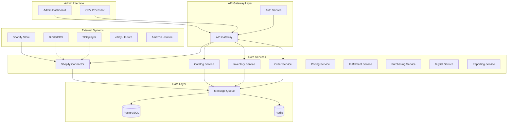

# CardStore Operations Layer - Architecture Foundation

## Overview

This document outlines the foundational architecture for the CardStore operations layer that integrates with BinderPOS (in-store POS), Shopify (backend system of record), and TCGplayer (marketplace), while adding support for additional marketplaces and advanced inventory management.

## Technology Stack Recommendation

### Core Technologies
- **Runtime**: Node.js 18+ with TypeScript for type safety and excellent API integration capabilities
- **Architecture**: Event-driven microservices with domain-driven design
- **Database**: PostgreSQL 15+ for transactional data with JSONB support for flexible schemas
- **Cache/Sessions**: Redis 7+ for caching, sessions, and lightweight message queues
- **Message Queue**: NATS or Redis Streams for event processing and service communication
- **API Framework**: Express.js with OpenAPI/Swagger documentation
- **ORM**: Prisma for type-safe database operations and migrations

### Infrastructure
- **Containerization**: Docker with multi-stage builds
- **Orchestration**: Kubernetes or Docker Compose for local development
- **Cloud**: Cloud-agnostic design (AWS/GCP/Azure compatible)
- **Monitoring**: Prometheus + Grafana for metrics, structured logging with Winston
- **Security**: OAuth 2.0/OIDC, RBAC, encryption at rest and in transit

## System Architecture



## Core Data Models

### Product & Catalog
```typescript
interface Product {
  id: string;
  shopify_product_id: string;
  title: string;
  category: string;
  vendor: string;
  created_at: Date;
  updated_at: Date;
}

interface ProductVariant {
  id: string;
  shopify_variant_id: string;
  product_id: string;
  sku: string;
  barcode?: string;
  title: string;
  price: number;
  // TCG-specific attributes
  attributes: {
    language?: string;
    set?: string;
    rarity?: string;
    condition?: string;
    grading?: {
      company: string;
      grade: string;
      cert_number: string;
    };
    foil?: boolean;
    serial_number?: string;
  };
}
```

### Inventory Management
```typescript
interface InventoryItem {
  id: string;
  variant_id: string;
  location_id: string;
  shopify_location_id?: string;
  on_hand: number;
  reserved: number;
  available_to_sell: number;
  safety_stock: number;
  channel_buffers: {
    [channel: string]: number;
  };
  last_counted_at?: Date;
}

interface InventoryLocation {
  id: string;
  shopify_location_id?: string;
  name: string;
  type: 'warehouse' | 'store' | 'virtual';
  address?: Address;
}
```

### Order Management
```typescript
interface Order {
  id: string;
  shopify_order_id?: string;
  external_order_id?: string;
  source: 'shopify' | 'binderpos' | 'tcgplayer' | 'ebay' | 'amazon';
  customer_id?: string;
  status: 'pending' | 'processing' | 'fulfilled' | 'cancelled';
  financial_status: 'pending' | 'paid' | 'refunded';
  fulfillment_status: 'unfulfilled' | 'partial' | 'fulfilled';
  total_price: number;
  currency: string;
  line_items: OrderLineItem[];
  shipping_address?: Address;
  billing_address?: Address;
  created_at: Date;
  updated_at: Date;
}

interface OrderLineItem {
  id: string;
  variant_id: string;
  quantity: number;
  price: number;
  fulfilled_quantity: number;
}
```

## Service Architecture Details

### 1. Shopify Connector Service
**Purpose**: Primary integration with Shopify as system of record
- **Responsibilities**:
  - Webhook processing (products, orders, inventory, customers)
  - Admin API operations (CRUD operations)
  - Bulk operations via GraphQL Admin API
  - Rate limit management and retry logic
  - HMAC signature verification

### 2. Catalog Service
**Purpose**: TCG-specific product attribute overlay
- **Responsibilities**:
  - Maintain TCG attributes linked to Shopify products
  - Search and filtering capabilities
  - Metafield synchronization to Shopify
  - Unique/graded item management
  - Product enrichment workflows

### 3. Inventory Service
**Purpose**: Multi-location, multi-channel inventory orchestration
- **Responsibilities**:
  - Real-time inventory tracking
  - Channel buffer management
  - Safety stock calculations
  - Inventory reconciliation
  - Location-based allocation

### 4. Order Service
**Purpose**: Unified order management across all channels
- **Responsibilities**:
  - Order ingestion from multiple sources
  - Deduplication by external IDs
  - Order status synchronization
  - Returns and refunds processing
  - Partial fulfillment handling

## Event-Driven Architecture

### Core Events
```typescript
// Inventory Events
interface InventoryChangedEvent {
  type: 'inventory.changed';
  variant_id: string;
  location_id: string;
  previous_quantity: number;
  new_quantity: number;
  reason: 'sale' | 'restock' | 'adjustment' | 'return';
  source: string;
  timestamp: Date;
}

// Order Events
interface OrderCreatedEvent {
  type: 'order.created';
  order_id: string;
  source: string;
  line_items: Array<{
    variant_id: string;
    quantity: number;
  }>;
  timestamp: Date;
}

// Product Events
interface ProductUpdatedEvent {
  type: 'product.updated';
  product_id: string;
  shopify_product_id: string;
  changes: Record<string, any>;
  timestamp: Date;
}
```

### Event Processing Patterns
- **Outbox Pattern**: Ensure reliable event publishing
- **Idempotency**: Handle duplicate events gracefully
- **Dead Letter Queues**: Handle failed event processing
- **Event Sourcing**: For critical inventory operations

## Integration Strategy

### Phase 1: Shopify Foundation (Weeks 1-4)
1. **Shopify Webhook Processing**
   - Product/variant webhooks
   - Order webhooks
   - Inventory level webhooks
   - Customer webhooks

2. **Shopify Admin API Integration**
   - Product management
   - Inventory management
   - Order fulfillment
   - Metafield operations

3. **Core Services Setup**
   - Catalog service with TCG attributes
   - Inventory service with location support
   - Basic order processing

### Phase 2: BinderPOS/TCGplayer Research & Integration (Weeks 3-8)
1. **API Research & Documentation**
   - BinderPOS API capabilities and webhook support
   - TCGplayer API for price feeds and order reconciliation
   - Integration patterns and data flow mapping

2. **Integration Implementation**
   - BinderPOS connector (if direct API available)
   - TCGplayer price feed integration
   - Order reconciliation workflows

### Phase 3: Marketplace Expansion (Weeks 6-12)
1. **eBay Integration**
   - Listing management
   - Order processing
   - Inventory synchronization

2. **Amazon/Google Preparation**
   - Connector architecture
   - Template system for listings
   - Channel-specific business rules

## Security & Compliance

### Authentication & Authorization
- **OAuth 2.0/OIDC** for user authentication
- **API Keys** for service-to-service communication
- **RBAC** with roles: Owner, Manager, Inventory Staff, Fulfillment
- **Multi-tenant isolation** for future SaaS expansion

### Data Protection
- **Encryption at rest** (database, file storage)
- **Encryption in transit** (TLS 1.3)
- **PII handling** with data retention policies
- **Audit logging** for all data modifications
- **Webhook signature verification** (HMAC)

## Operational Excellence

### Monitoring & Observability
- **Structured logging** with correlation IDs
- **Metrics collection** (Prometheus format)
- **Distributed tracing** for request flows
- **Health checks** for all services
- **SLA monitoring** for external API calls

### Reliability Patterns
- **Circuit breakers** for external API calls
- **Retry with exponential backoff**
- **Graceful degradation** when services are unavailable
- **Database connection pooling**
- **Rate limiting** to protect against abuse

### Development Practices
- **Infrastructure as Code** (Terraform/Pulumi)
- **CI/CD pipelines** with automated testing
- **Database migrations** with rollback capability
- **Feature flags** for gradual rollouts
- **API versioning** strategy

## Next Steps

1. **Environment Setup**: Initialize project structure and development environment
2. **Core Infrastructure**: Set up databases, message queues, and monitoring
3. **Shopify Integration**: Implement webhook processing and Admin API client
4. **Data Models**: Create database schemas and ORM models
5. **API Research**: Document BinderPOS and TCGplayer integration requirements

This foundation provides a scalable, maintainable architecture that can grow with your business needs while maintaining integration flexibility and operational reliability.