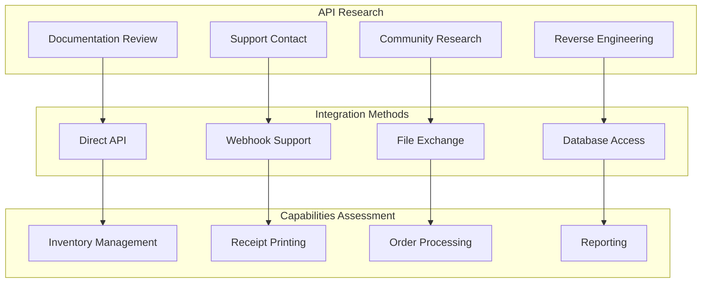

# BinderPOS Integration Research and Implementation Plan

## Document Information
- **Version**: 1.0
- **Date**: 2025-08-05
- **Status**: Research and Implementation Plan
- **Owner**: Engineering Team
- **Priority**: Critical (Core Automation Requirement)

## Executive Summary

This document outlines the comprehensive research and implementation plan for integrating with BinderPOS to enable automated inventory updates and receipt printing when Shopify orders are placed. This integration is the cornerstone of the automation workflow.

## Research Phase

### 1. BinderPOS API Investigation

#### Primary Research Tasks


#### Research Checklist
- [ ] **Official Documentation Review**
  - BinderPOS developer documentation
  - API reference guides
  - Integration examples
  - SDK availability

- [ ] **Vendor Contact**
  - Contact BinderPOS support team
  - Request API access credentials
  - Inquire about webhook capabilities
  - Ask for integration best practices

- [ ] **Community Research**
  - Search developer forums
  - Check GitHub repositories
  - Review third-party integrations
  - Analyze competitor implementations

- [ ] **Technical Analysis**
  - Network traffic analysis
  - Database schema investigation
  - File format analysis
  - Protocol reverse engineering

### 2. Integration Method Evaluation

#### Method 1: Direct REST API Integration (Preferred)
```typescript
interface BinderPOSAPI {
  // Authentication
  authenticate(credentials: BinderPOSCredentials): Promise<AuthToken>;
  refreshToken(token: RefreshToken): Promise<AuthToken>;
  
  // Inventory Management
  getInventory(filters?: InventoryFilters): Promise<InventoryItem[]>;
  updateInventory(updates: InventoryUpdate[]): Promise<UpdateResult>;
  getProduct(sku: string): Promise<Product>;
  
  // Receipt Printing
  printReceipt(receipt: ReceiptData): Promise<PrintJob>;
  getPrintStatus(jobId: string): Promise<PrintStatus>;
  getPrinters(): Promise<Printer[]>;
  
  // Order Management
  createOrder(order: OrderData): Promise<Order>;
  updateOrder(orderId: string, updates: OrderUpdate): Promise<Order>;
  getOrders(filters?: OrderFilters): Promise<Order[]>;
}
```

**Advantages:**
- Real-time synchronization
- Immediate error feedback
- Full control over timing
- Robust error handling

**Requirements:**
- API documentation
- Authentication credentials
- Rate limiting understanding
- Error code mapping

#### Method 2: Webhook Integration (Alternative)
```typescript
interface BinderPOSWebhooks {
  // Webhook Registration
  registerWebhook(url: string, events: string[]): Promise<WebhookRegistration>;
  
  // Event Handlers
  onInventoryUpdate(handler: (event: InventoryUpdateEvent) => void): void;
  onOrderCreated(handler: (event: OrderCreatedEvent) => void): void;
  onPrintCompleted(handler: (event: PrintCompletedEvent) => void): void;
}
```

**Advantages:**
- Event-driven architecture
- Reduced polling overhead
- Real-time notifications
- Scalable design

**Requirements:**
- Webhook endpoint setup
- Event schema documentation
- Security verification
- Retry mechanisms

#### Method 3: File-Based Integration (Fallback)
```typescript
interface BinderPOSFileExchange {
  // File Operations
  exportInventory(format: 'csv' | 'xml' | 'json'): Promise<string>;
  importInventory(filePath: string): Promise<ImportResult>;
  
  // Print Queue Management
  addToPrintQueue(receipt: ReceiptData): Promise<void>;
  processPrintQueue(): Promise<ProcessResult>;
  
  // Monitoring
  watchDirectory(path: string, callback: FileChangeCallback): void;
}
```

**Advantages:**
- No API dependency
- Batch processing capability
- Offline operation support
- Simple implementation

**Disadvantages:**
- Delayed synchronization
- File system dependencies
- Limited real-time capability
- Error detection delays

#### Method 4: Database Direct Access (Last Resort)
```typescript
interface BinderPOSDatabase {
  // Direct Database Operations
  connectToDatabase(config: DatabaseConfig): Promise<Connection>;
  executeQuery(query: string, params?: any[]): Promise<QueryResult>;
  
  // Inventory Operations
  updateInventoryDirect(updates: InventoryUpdate[]): Promise<void>;
  getInventoryDirect(filters?: any): Promise<InventoryItem[]>;
  
  // Print Operations
  insertPrintJob(job: PrintJobData): Promise<void>;
  updatePrintStatus(jobId: string, status: string): Promise<void>;
}
```

**Advantages:**
- Complete control
- Maximum performance
- No API limitations
- Direct data access

**Disadvantages:**
- High risk of data corruption
- Version compatibility issues
- Support complications
- Security concerns

## Implementation Strategy

### Phase 1: Research and Discovery (Week 1)

#### Day 1-2: Documentation and Vendor Contact
```bash
# Research Tasks
1. Download BinderPOS documentation
2. Contact BinderPOS support team
3. Request developer access
4. Identify integration options
```

#### Day 3-4: Technical Investigation
```bash
# Technical Analysis
1. Network traffic capture during BinderPOS operations
2. Database file analysis (if accessible)
3. Configuration file examination
4. Log file analysis
```

#### Day 5-7: Proof of Concept Development
```bash
# POC Development
1. Create basic connection test
2. Implement simple inventory query
3. Test receipt printing capability
4. Document findings and recommendations
```

### Phase 2: Integration Development (Weeks 2-3)

#### Core Integration Components

##### 1. BinderPOS Connection Manager
```typescript
class BinderPOSConnectionManager {
  private connection: BinderPOSConnection | null = null;
  private config: BinderPOSConfig;
  private healthChecker: HealthChecker;
  
  constructor(config: BinderPOSConfig) {
    this.config = config;
    this.healthChecker = new HealthChecker(this.testConnection.bind(this));
  }
  
  async connect(): Promise<void> {
    try {
      this.connection = await this.createConnection();
      await this.authenticate();
      this.startHealthMonitoring();
    } catch (error) {
      throw new BinderPOSConnectionError('Failed to connect to BinderPOS', error);
    }
  }
  
  async testConnection(): Promise<boolean> {
    try {
      const result = await this.connection?.ping();
      return result?.success || false;
    } catch {
      return false;
    }
  }
  
  private async createConnection(): Promise<BinderPOSConnection> {
    switch (this.config.method) {
      case 'api':
        return new BinderPOSAPIConnection(this.config.api);
      case 'webhook':
        return new BinderPOSWebhookConnection(this.config.webhook);
      case 'file':
        return new BinderPOSFileConnection(this.config.file);
      case 'database':
        return new BinderPOSDatabaseConnection(this.config.database);
      default:
        throw new Error(`Unsupported connection method: ${this.config.method}`);
    }
  }
}
```

##### 2. Inventory Synchronization Service
```typescript
class BinderPOSInventorySync {
  private connectionManager: BinderPOSConnectionManager;
  private syncQueue: SyncQueue;
  private conflictResolver: ConflictResolver;
  
  constructor(connectionManager: BinderPOSConnectionManager) {
    this.connectionManager = connectionManager;
    this.syncQueue = new SyncQueue();
    this.conflictResolver = new ConflictResolver();
  }
  
  async syncInventoryUpdate(update: InventoryUpdate): Promise<SyncResult> {
    try {
      // Validate update
      await this.validateUpdate(update);
      
      // Apply to BinderPOS
      const result = await this.applyToBinderPOS(update);
      
      // Handle conflicts
      if (result.conflicts) {
        await this.conflictResolver.resolve(result.conflicts);
      }
      
      // Log success
      await this.logSyncSuccess(update, result);
      
      return result;
    } catch (error) {
      await this.handleSyncError(update, error);
      throw error;
    }
  }
  
  private async applyToBinderPOS(update: InventoryUpdate): Promise<SyncResult> {
    const connection = await this.connectionManager.getConnection();
    
    switch (update.operation) {
      case 'decrement':
        return await connection.decrementInventory(update.sku, update.quantity);
      case 'increment':
        return await connection.incrementInventory(update.sku, update.quantity);
      case 'set':
        return await connection.setInventory(update.sku, update.quantity);
      default:
        throw new Error(`Unsupported operation: ${update.operation}`);
    }
  }
}
```

##### 3. Receipt Printing Service
```typescript
class BinderPOSReceiptPrinter {
  private connectionManager: BinderPOSConnectionManager;
  private printQueue: PrintQueue;
  private templateManager: ReceiptTemplateManager;
  
  constructor(connectionManager: BinderPOSConnectionManager) {
    this.connectionManager = connectionManager;
    this.printQueue = new PrintQueue();
    this.templateManager = new ReceiptTemplateManager();
  }
  
  async printOrderReceipt(order: Order): Promise<PrintJob> {
    try {
      // Generate receipt data
      const receiptData = await this.generateReceiptData(order);
      
      // Apply template
      const formattedReceipt = await this.templateManager.format(receiptData);
      
      // Submit print job
      const printJob = await this.submitPrintJob(formattedReceipt);
      
      // Monitor print status
      this.monitorPrintJob(printJob);
      
      return printJob;
    } catch (error) {
      await this.handlePrintError(order, error);
      throw error;
    }
  }
  
  private async generateReceiptData(order: Order): Promise<ReceiptData> {
    return {
      orderId: order.id,
      orderNumber: order.orderNumber,
      timestamp: new Date(),
      items: order.lineItems.map(item => ({
        sku: item.sku,
        title: item.title,
        quantity: item.quantity,
        location: item.binLocation || 'General',
        notes: item.notes
      })),
      pickingInstructions: await this.generatePickingInstructions(order),
      totalItems: order.lineItems.reduce((sum, item) => sum + item.quantity, 0)
    };
  }
  
  private async submitPrintJob(receipt: FormattedReceipt): Promise<PrintJob> {
    const connection = await this.connectionManager.getConnection();
    
    const printJob = await connection.print({
      type: 'receipt',
      data: receipt,
      printer: 'default',
      copies: 1,
      priority: 'normal'
    });
    
    return printJob;
  }
}
```

### Phase 3: Frontend Integration (Week 4)

#### BinderPOS Management Interface
```javascript
class BinderPOSManager {
  constructor() {
    this.connectionStatus = 'disconnected';
    this.lastSync = null;
    this.printQueue = [];
    this.errors = [];
  }
  
  async initialize() {
    await this.loadConfiguration();
    await this.testConnection();
    this.setupEventListeners();
    this.startStatusMonitoring();
  }
  
  // Connection Management
  async testConnection() {
    try {
      const response = await api.post('/binderpos/test-connection');
      this.updateConnectionStatus(response.connected);
      return response.connected;
    } catch (error) {
      this.handleConnectionError(error);
      return false;
    }
  }
  
  // Configuration Interface
  renderConfigurationPanel() {
    return `
      <div class="binderpos-config">
        <h3>BinderPOS Integration Configuration</h3>
        
        <div class="config-section">
          <label>Integration Method:</label>
          <select id="integration-method">
            <option value="api">Direct API</option>
            <option value="webhook">Webhook</option>
            <option value="file">File Exchange</option>
            <option value="database">Database Direct</option>
          </select>
        </div>
        
        <div class="config-section" id="api-config">
          <label>API Endpoint:</label>
          <input type="url" id="api-endpoint" placeholder="https://api.binderpos.com">
          
          <label>API Key:</label>
          <input type="password" id="api-key" placeholder="Your API Key">
          
          <label>Store ID:</label>
          <input type="text" id="store-id" placeholder="Store Identifier">
        </div>
        
        <div class="config-actions">
          <button onclick="this.testConnection()" class="btn-primary">Test Connection</button>
          <button onclick="this.saveConfiguration()" class="btn-success">Save Configuration</button>
        </div>
      </div>
    `;
  }
  
  // Print Queue Management
  renderPrintQueue() {
    return `
      <div class="print-queue">
        <h3>Receipt Print Queue</h3>
        
        <div class="queue-stats">
          <div class="stat">
            <span class="label">Pending:</span>
            <span class="value">${this.printQueue.filter(j => j.status === 'pending').length}</span>
          </div>
          <div class="stat">
            <span class="label">Printing:</span>
            <span class="value">${this.printQueue.filter(j => j.status === 'printing').length}</span>
          </div>
          <div class="stat">
            <span class="label">Failed:</span>
            <span class="value">${this.printQueue.filter(j => j.status === 'failed').length}</span>
          </div>
        </div>
        
        <div class="queue-list">
          ${this.printQueue.map(job => this.renderPrintJob(job)).join('')}
        </div>
        
        <div class="queue-actions">
          <button onclick="this.retryFailedJobs()" class="btn-warning">Retry Failed</button>
          <button onclick="this.clearCompletedJobs()" class="btn-secondary">Clear Completed</button>
        </div>
      </div>
    `;
  }
  
  // Error Handling Interface
  renderErrorDashboard() {
    return `
      <div class="error-dashboard">
        <h3>BinderPOS Integration Errors</h3>
        
        <div class="error-summary">
          <div class="error-count">
            <span class="count">${this.errors.length}</span>
            <span class="label">Total Errors</span>
          </div>
          <div class="error-rate">
            <span class="rate">${this.calculateErrorRate()}%</span>
            <span class="label">Error Rate</span>
          </div>
        </div>
        
        <div class="error-list">
          ${this.errors.map(error => this.renderError(error)).join('')}
        </div>
      </div>
    `;
  }
}
```

## Testing Strategy

### 1. Unit Testing
```typescript
describe('BinderPOS Integration', () => {
  describe('Connection Manager', () => {
    it('should establish connection successfully', async () => {
      const manager = new BinderPOSConnectionManager(testConfig);
      await expect(manager.connect()).resolves.not.toThrow();
    });
    
    it('should handle connection failures gracefully', async () => {
      const manager = new BinderPOSConnectionManager(invalidConfig);
      await expect(manager.connect()).rejects.toThrow(BinderPOSConnectionError);
    });
  });
  
  describe('Inventory Sync', () => {
    it('should sync inventory updates correctly', async () => {
      const sync = new BinderPOSInventorySync(mockConnectionManager);
      const update = { sku: 'TEST-001', operation: 'decrement', quantity: 1 };
      
      const result = await sync.syncInventoryUpdate(update);
      expect(result.success).toBe(true);
    });
  });
  
  describe('Receipt Printing', () => {
    it('should generate and print receipts', async () => {
      const printer = new BinderPOSReceiptPrinter(mockConnectionManager);
      const order = createMockOrder();
      
      const printJob = await printer.printOrderReceipt(order);
      expect(printJob.status).toBe('submitted');
    });
  });
});
```

### 2. Integration Testing
```typescript
describe('End-to-End Integration', () => {
  it('should process complete order workflow', async () => {
    // 1. Receive Shopify order
    const shopifyOrder = createMockShopifyOrder();
    
    // 2. Process through automation
    const result = await automationService.processOrder(shopifyOrder);
    
    // 3. Verify BinderPOS inventory updated
    const inventory = await binderPOSService.getInventory(shopifyOrder.lineItems[0].sku);
    expect(inventory.quantity).toBe(expectedQuantity);
    
    // 4. Verify receipt printed
    const printJobs = await binderPOSService.getPrintJobs();
    expect(printJobs).toContainEqual(expect.objectContaining({
      orderId: shopifyOrder.id,
      status: 'completed'
    }));
  });
});
```

### 3. Load Testing
```typescript
describe('Performance Testing', () => {
  it('should handle high order volume', async () => {
    const orders = Array.from({ length: 100 }, () => createMockOrder());
    
    const startTime = Date.now();
    const results = await Promise.all(
      orders.map(order => automationService.processOrder(order))
    );
    const endTime = Date.now();
    
    const processingTime = endTime - startTime;
    const averageTime = processingTime / orders.length;
    
    expect(averageTime).toBeLessThan(5000); // 5 seconds per order
    expect(results.every(r => r.success)).toBe(true);
  });
});
```

## Risk Mitigation

### 1. Connection Reliability
- **Circuit Breaker Pattern**: Prevent cascade failures
- **Retry Logic**: Exponential backoff for failed requests
- **Health Monitoring**: Continuous connection health checks
- **Fallback Mechanisms**: Alternative integration methods

### 2. Data Consistency
- **Transaction Management**: Atomic operations where possible
- **Conflict Resolution**: Automated and manual conflict handling
- **Audit Trail**: Complete logging of all operations
- **Rollback Capability**: Ability to reverse failed operations

### 3. Error Handling
- **Comprehensive Logging**: Detailed error information
- **Alert System**: Immediate notification of critical errors
- **Manual Override**: Ability to bypass automation when needed
- **Error Recovery**: Automated recovery procedures

## Success Metrics

### 1. Performance Metrics
- **Order Processing Time**: < 5 seconds from Shopify to receipt print
- **Success Rate**: > 99% successful automation
- **Inventory Accuracy**: < 1% discrepancy between systems
- **Print Success Rate**: > 98% successful receipt printing

### 2. Reliability Metrics
- **Uptime**: > 99.9% integration availability
- **Error Rate**: < 1% of all operations
- **Recovery Time**: < 30 seconds for automatic recovery
- **Manual Intervention**: < 5% of orders requiring manual intervention

### 3. Business Metrics
- **Operational Efficiency**: 80% reduction in manual processing time
- **Error Reduction**: 90% reduction in inventory discrepancies
- **Customer Satisfaction**: Faster order fulfillment
- **Staff Productivity**: Increased focus on value-added activities

## Conclusion

This comprehensive BinderPOS integration plan provides multiple pathways to achieve the core automation requirement. The phased approach allows for rapid implementation of basic functionality while building toward a robust, scalable integration.

The research phase will determine the optimal integration method, while the implementation phases will deliver a production-ready solution with comprehensive monitoring, error handling, and performance optimization.

Success depends on thorough research, careful implementation, and extensive testing to ensure reliable automation of the critical order-to-receipt workflow.