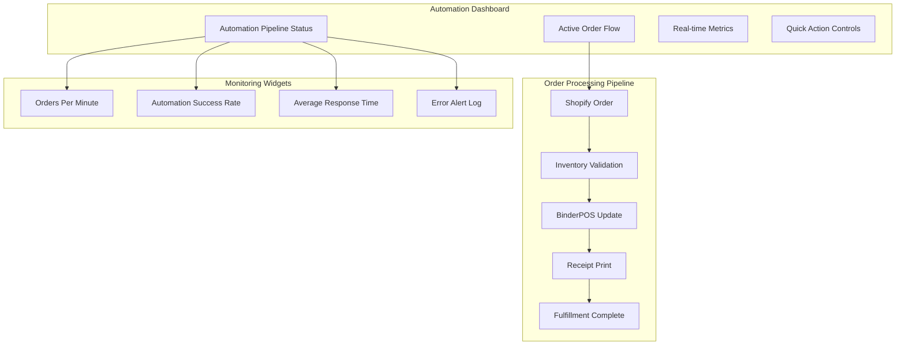
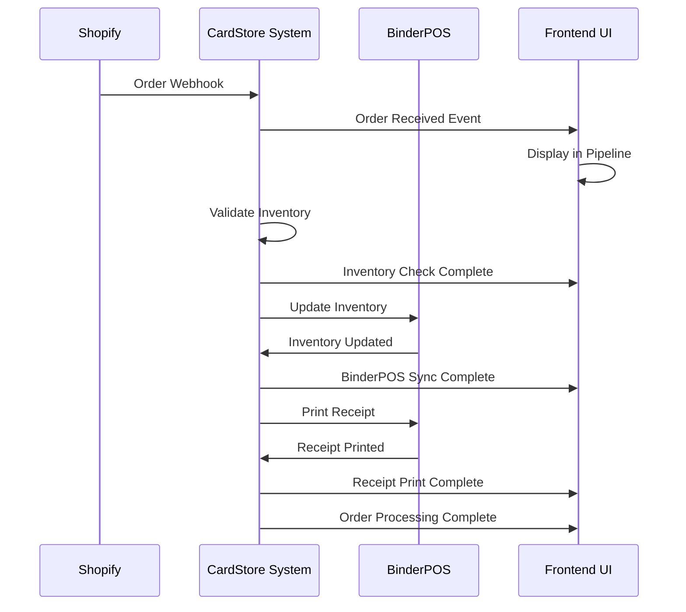
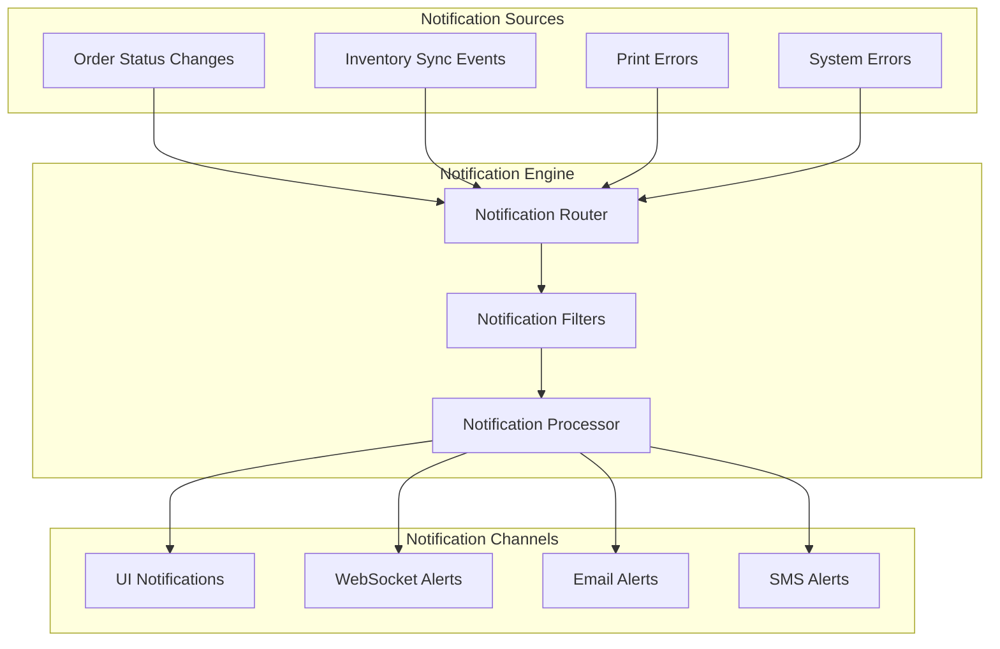

# CardStore Operations Layer - Frontend Automation Architecture Plan

## Document Information
- **Version**: 1.0
- **Date**: 2025-08-05
- **Status**: Architecture Plan
- **Owner**: Engineering Team
- **Purpose**: Comprehensive frontend architecture for full automation workflow

## Executive Summary

This document outlines the frontend architecture required to support full automation of the CardStore Operations Layer, with the core requirement being: **When an order is placed in Shopify, automatically update BinderPOS inventory and print a receipt for item picking**.

The frontend will provide real-time monitoring, configuration, and control interfaces for the complete automation workflow, building upon the existing robust backend services.

## Current Frontend Capabilities Analysis

### Existing Strengths
- **Comprehensive Admin Dashboard**: Health monitoring, system management, user management
- **Real-time WebSocket Integration**: Live updates and notifications
- **Mobile-Responsive Design**: Touch-friendly interface for warehouse operations
- **Modular Architecture**: Well-structured JavaScript modules for extensibility
- **API Integration Layer**: Robust API communication with error handling
- **Service Management**: Docker service control and environment configuration

### Automation Gaps Identified
1. **No Real-time Order Flow Monitoring**: Missing visual pipeline for order processing
2. **Limited BinderPOS Integration Interface**: No dedicated BinderPOS management UI
3. **No Automation Configuration Panel**: Missing centralized automation settings
4. **No Receipt Printing Controls**: No interface for managing print jobs
5. **Limited Error Handling UI**: No dedicated automation error management
6. **No Automation Analytics**: Missing performance metrics for automated processes

## Frontend Automation Architecture

### 1. Real-Time Automation Dashboard

#### Core Components


#### Dashboard Features
- **Live Order Pipeline Visualization**: Real-time flow showing orders moving through automation stages
- **Automation Health Metrics**: Success rates, processing times, error counts
- **Quick Intervention Controls**: Manual override buttons for stuck orders
- **Performance Analytics**: Throughput metrics and bottleneck identification

### 2. BinderPOS Integration Management

#### Integration Strategy
Based on research, BinderPOS integration will follow this priority order:

1. **Direct API Integration** (Preferred)
   - Research BinderPOS API documentation
   - Implement direct receipt printing triggers
   - Real-time inventory synchronization

2. **Webhook Integration** (Alternative)
   - Set up BinderPOS webhooks if available
   - Event-driven receipt printing

3. **File-Based Integration** (Fallback)
   - CSV/XML file exchange for inventory updates
   - Print queue management via file system

4. **Shopify-Mediated Integration** (Last Resort)
   - Use existing BinderPOS → Shopify sync
   - Trigger receipts via Shopify order events

#### Frontend Interface Components
```typescript
interface BinderPOSManager {
  // Connection Management
  testConnection(): Promise<boolean>;
  configureCredentials(config: BinderPOSConfig): Promise<void>;
  
  // Receipt Management
  printReceipt(orderId: string, items: OrderItem[]): Promise<PrintJob>;
  getPrintQueue(): Promise<PrintJob[]>;
  retryFailedPrint(printJobId: string): Promise<void>;
  
  // Inventory Sync
  syncInventoryToBinderPOS(updates: InventoryUpdate[]): Promise<SyncResult>;
  getLastSyncStatus(): Promise<SyncStatus>;
  
  // Monitoring
  getConnectionHealth(): Promise<HealthStatus>;
  getRecentActivity(): Promise<Activity[]>;
}
```

### 3. Automated Order Processing Workflow Frontend

#### Workflow Visualization


#### Frontend Components

##### Order Pipeline Component
```javascript
class OrderPipelineWidget {
  constructor() {
    this.stages = [
      { id: 'received', name: 'Order Received', icon: 'shopping-cart' },
      { id: 'validated', name: 'Inventory Validated', icon: 'check-circle' },
      { id: 'synced', name: 'BinderPOS Updated', icon: 'sync' },
      { id: 'printed', name: 'Receipt Printed', icon: 'print' },
      { id: 'complete', name: 'Ready for Picking', icon: 'package' }
    ];
  }
  
  updateOrderStatus(orderId, stage, status) {
    // Update visual pipeline
    // Show progress indicators
    // Handle errors with retry options
  }
  
  renderPipeline() {
    // Create visual pipeline with order cards
    // Show real-time progress
    // Enable manual interventions
  }
}
```

##### Automation Controls Panel
```javascript
class AutomationControlPanel {
  constructor() {
    this.automationRules = new Map();
    this.activeProcesses = new Set();
  }
  
  // Automation Configuration
  configureAutomationRules(rules) {
    // Set up automation triggers
    // Configure retry policies
    // Set error handling preferences
  }
  
  // Manual Overrides
  pauseAutomation(reason) {
    // Temporarily stop automation
    // Queue incoming orders
    // Notify operators
  }
  
  resumeAutomation() {
    // Resume automation
    // Process queued orders
    // Update status
  }
  
  // Emergency Controls
  emergencyStop() {
    // Immediate halt of all automation
    // Preserve order state
    // Alert administrators
  }
}
```

### 4. Inventory Synchronization Monitoring

#### Real-Time Sync Dashboard
```javascript
class InventorySyncMonitor {
  constructor() {
    this.syncQueues = {
      shopify: new SyncQueue('Shopify'),
      binderpos: new SyncQueue('BinderPOS'),
      marketplaces: new SyncQueue('Marketplaces')
    };
  }
  
  // Sync Status Monitoring
  displaySyncStatus() {
    // Show sync health for each system
    // Display last sync times
    // Show pending sync items
  }
  
  // Conflict Resolution
  handleSyncConflicts(conflicts) {
    // Display inventory discrepancies
    // Provide resolution options
    // Track resolution decisions
  }
  
  // Bulk Operations
  triggerBulkSync(systems, options) {
    // Initiate bulk synchronization
    // Show progress indicators
    // Handle errors gracefully
  }
}
```

### 5. Receipt Printing Automation Controls

#### Print Management Interface
```javascript
class ReceiptPrintManager {
  constructor() {
    this.printQueues = new Map();
    this.printerStatus = new Map();
  }
  
  // Print Queue Management
  displayPrintQueue() {
    // Show pending print jobs
    // Display printer status
    // Enable manual print triggers
  }
  
  // Printer Configuration
  configurePrinters(printers) {
    // Set up BinderPOS printer connections
    // Test printer connectivity
    // Configure print templates
  }
  
  // Error Handling
  handlePrintErrors(errors) {
    // Display failed print jobs
    // Provide retry mechanisms
    // Show printer diagnostics
  }
  
  // Receipt Templates
  manageReceiptTemplates() {
    // Configure receipt layouts
    // Preview receipt formats
    // Test print templates
  }
}
```

### 6. Comprehensive Automation Configuration Interface

#### Configuration Management
```javascript
class AutomationConfigManager {
  constructor() {
    this.configSections = {
      general: new GeneralConfig(),
      shopify: new ShopifyConfig(),
      binderpos: new BinderPOSConfig(),
      inventory: new InventoryConfig(),
      printing: new PrintingConfig(),
      notifications: new NotificationConfig()
    };
  }
  
  // Configuration Wizard
  launchConfigWizard() {
    // Step-by-step automation setup
    // Validate configurations
    // Test integrations
  }
  
  // Advanced Settings
  configureAdvancedRules() {
    // Complex automation rules
    // Conditional logic setup
    // Custom workflow definitions
  }
  
  // Import/Export
  exportConfiguration() {
    // Export automation settings
    // Create configuration backups
    // Enable configuration sharing
  }
}
```

### 7. Real-Time Notification System

#### Notification Architecture


#### Notification Components
```javascript
class AutomationNotificationSystem {
  constructor() {
    this.notificationTypes = {
      success: { priority: 'low', channels: ['ui'] },
      warning: { priority: 'medium', channels: ['ui', 'email'] },
      error: { priority: 'high', channels: ['ui', 'email', 'sms'] },
      critical: { priority: 'critical', channels: ['all'] }
    };
  }
  
  // Real-time Alerts
  displayRealTimeAlerts() {
    // Show live automation alerts
    // Categorize by severity
    // Enable quick actions
  }
  
  // Alert Configuration
  configureAlertRules() {
    // Set up alert conditions
    // Configure notification channels
    // Set escalation policies
  }
  
  // Alert History
  showAlertHistory() {
    // Display past alerts
    // Show resolution status
    // Analyze alert patterns
  }
}
```

### 8. Automation Analytics and Reporting Dashboard

#### Analytics Components
```javascript
class AutomationAnalytics {
  constructor() {
    this.metrics = {
      throughput: new ThroughputMetrics(),
      performance: new PerformanceMetrics(),
      reliability: new ReliabilityMetrics(),
      efficiency: new EfficiencyMetrics()
    };
  }
  
  // Performance Dashboards
  renderPerformanceDashboard() {
    // Orders processed per hour/day
    // Average processing time
    // Success/failure rates
    // Bottleneck identification
  }
  
  // Trend Analysis
  analyzeTrends() {
    // Historical performance trends
    // Seasonal patterns
    // Growth projections
    // Optimization opportunities
  }
  
  // Custom Reports
  generateCustomReports() {
    // Configurable report builder
    // Scheduled report generation
    // Export capabilities
    // Stakeholder distribution
  }
}
```

### 9. Mobile-Responsive Automation Monitoring

#### Mobile Interface Design
```javascript
class MobileAutomationInterface {
  constructor() {
    this.mobileViews = {
      dashboard: new MobileDashboard(),
      orders: new MobileOrderView(),
      alerts: new MobileAlertView(),
      controls: new MobileControlView()
    };
  }
  
  // Touch-Optimized Controls
  renderMobileControls() {
    // Large touch targets
    // Swipe gestures for navigation
    // Voice commands for hands-free operation
    // Offline capability for warehouse use
  }
  
  // Warehouse Operations
  warehousePickingInterface() {
    // Barcode scanning integration
    // Pick list display
    // Inventory updates
    // Print job management
  }
}
```

### 10. Error Handling and Manual Intervention Interfaces

#### Error Management System
```javascript
class AutomationErrorManager {
  constructor() {
    this.errorCategories = {
      connectivity: new ConnectivityErrors(),
      inventory: new InventoryErrors(),
      printing: new PrintingErrors(),
      validation: new ValidationErrors()
    };
  }
  
  // Error Dashboard
  displayErrorDashboard() {
    // Categorized error display
    // Error frequency analysis
    // Resolution tracking
    // Escalation management
  }
  
  // Manual Intervention Tools
  provideInterventionTools() {
    // Manual order processing
    // Inventory correction tools
    // Print job management
    // System override controls
  }
  
  // Error Resolution Workflows
  guideErrorResolution() {
    // Step-by-step resolution guides
    // Automated fix suggestions
    // Expert escalation paths
    // Resolution documentation
  }
}
```

## Implementation Roadmap

### Phase 1: Core Automation Infrastructure (Weeks 1-4)
1. **BinderPOS Integration Research and Implementation**
   - Research BinderPOS API capabilities
   - Implement connection management
   - Create basic receipt printing functionality
   - Test inventory synchronization

2. **Real-Time Order Pipeline Dashboard**
   - Build order flow visualization
   - Implement WebSocket event handling
   - Create basic automation controls
   - Add error handling interfaces

### Phase 2: Advanced Automation Features (Weeks 5-8)
1. **Comprehensive Configuration Interface**
   - Build automation configuration wizard
   - Implement advanced rule management
   - Create testing and validation tools
   - Add import/export capabilities

2. **Enhanced Monitoring and Analytics**
   - Develop performance dashboards
   - Implement trend analysis
   - Create custom reporting tools
   - Add predictive analytics

### Phase 3: Mobile and Advanced Features (Weeks 9-12)
1. **Mobile Automation Interface**
   - Optimize for mobile devices
   - Add warehouse picking interface
   - Implement offline capabilities
   - Integrate barcode scanning

2. **Advanced Error Management**
   - Build comprehensive error dashboard
   - Implement automated resolution
   - Create escalation workflows
   - Add expert system integration

### Phase 4: Optimization and Scaling (Weeks 13-16)
1. **Performance Optimization**
   - Optimize real-time updates
   - Implement caching strategies
   - Add load balancing support
   - Enhance scalability

2. **Advanced Analytics and AI**
   - Implement predictive analytics
   - Add machine learning insights
   - Create optimization recommendations
   - Build intelligent automation

## Technical Implementation Details

### Frontend Technology Stack
- **Core Framework**: Vanilla JavaScript (ES6+) with modular architecture
- **Real-time Communication**: WebSocket with automatic reconnection
- **UI Components**: Custom CSS with CSS Grid and Flexbox
- **Charts and Visualization**: Chart.js for analytics dashboards
- **Mobile Support**: Progressive Web App (PWA) capabilities
- **Offline Support**: Service Worker with IndexedDB caching

### API Integration Requirements
```javascript
// New API endpoints needed for automation
const automationEndpoints = {
  // BinderPOS Integration
  '/api/v1/binderpos/connect': 'POST',
  '/api/v1/binderpos/print-receipt': 'POST',
  '/api/v1/binderpos/sync-inventory': 'POST',
  '/api/v1/binderpos/status': 'GET',
  
  // Automation Control
  '/api/v1/automation/config': 'GET/PUT',
  '/api/v1/automation/start': 'POST',
  '/api/v1/automation/stop': 'POST',
  '/api/v1/automation/status': 'GET',
  
  // Order Pipeline
  '/api/v1/automation/orders/pipeline': 'GET',
  '/api/v1/automation/orders/retry': 'POST',
  '/api/v1/automation/orders/manual-process': 'POST',
  
  // Analytics
  '/api/v1/automation/analytics/performance': 'GET',
  '/api/v1/automation/analytics/trends': 'GET',
  '/api/v1/automation/analytics/reports': 'GET'
};
```

### WebSocket Event Schema
```javascript
const automationEvents = {
  // Order Processing Events
  'order.received': { orderId, timestamp, source },
  'order.validated': { orderId, inventoryStatus, timestamp },
  'order.synced': { orderId, binderposStatus, timestamp },
  'order.printed': { orderId, printJobId, timestamp },
  'order.completed': { orderId, totalTime, timestamp },
  
  // Error Events
  'automation.error': { type, orderId, error, timestamp },
  'binderpos.connection.lost': { timestamp, lastSuccess },
  'print.failed': { orderId, printJobId, error, timestamp },
  
  // System Events
  'automation.paused': { reason, timestamp },
  'automation.resumed': { timestamp },
  'sync.completed': { system, itemCount, timestamp }
};
```

## Security and Compliance Considerations

### Data Protection
- **Encryption**: All BinderPOS communications encrypted in transit
- **Authentication**: Secure API key management for BinderPOS
- **Audit Trail**: Complete logging of all automation actions
- **Access Control**: Role-based access to automation controls

### Compliance Requirements
- **PCI DSS**: Secure handling of payment-related order data
- **Data Retention**: Configurable retention policies for automation logs
- **Privacy**: Customer data protection in automated workflows
- **Regulatory**: Compliance with retail and inventory regulations

## Performance and Scalability

### Performance Targets
- **Order Processing**: < 5 seconds from Shopify webhook to receipt print
- **UI Responsiveness**: < 100ms for dashboard updates
- **Throughput**: Support 1000+ orders per hour
- **Availability**: 99.9% uptime for automation systems

### Scalability Considerations
- **Horizontal Scaling**: Support multiple BinderPOS instances
- **Load Balancing**: Distribute automation workload
- **Caching**: Intelligent caching for performance
- **Database Optimization**: Efficient queries for real-time data

## Testing and Validation Strategy

### Automated Testing
- **Unit Tests**: Individual component testing
- **Integration Tests**: End-to-end automation workflow testing
- **Performance Tests**: Load testing for high-volume scenarios
- **Security Tests**: Vulnerability and penetration testing

### Manual Testing
- **User Acceptance Testing**: Stakeholder validation
- **Usability Testing**: Interface and workflow validation
- **Stress Testing**: System behavior under extreme conditions
- **Disaster Recovery**: Failover and recovery testing

## Conclusion

This comprehensive frontend automation architecture provides a complete solution for automating the CardStore operations workflow. The modular design allows for incremental implementation while maintaining the flexibility to adapt to changing requirements.

The architecture leverages your existing robust backend services while adding the necessary frontend components to monitor, control, and optimize the automation workflow. The focus on real-time monitoring, error handling, and mobile responsiveness ensures that the system will be both powerful and user-friendly for daily operations.

The phased implementation approach allows for immediate value delivery with the core automation features while building toward a comprehensive automation platform that can scale with your business growth.