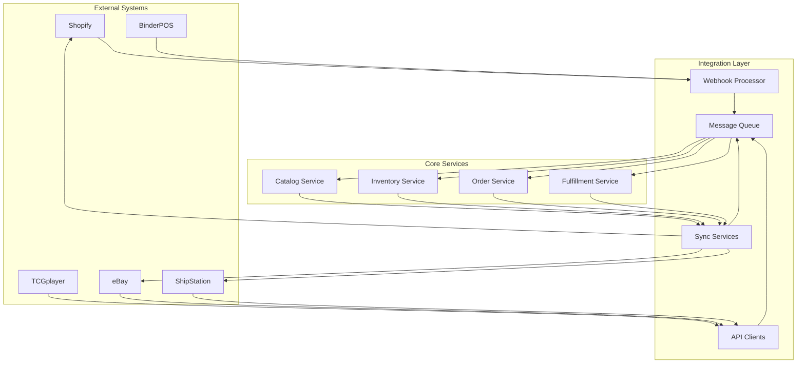

# CardStore Operations Layer - Integration Patterns Documentation

## Document Information
- **Version**: 1.0
- **Date**: 2025-08-02
- **Status**: Draft
- **Owner**: Engineering Team
- **Related Documents**: [Technical Design](./TECHNICAL_DESIGN.md), [PRD](./PRD.md)

## Table of Contents
1. [Integration Overview](#integration-overview)
2. [Shopify Integration](#shopify-integration)
3. [BinderPOS Integration](#binderpos-integration)
4. [TCGplayer Integration](#tcgplayer-integration)
5. [Marketplace Integrations](#marketplace-integrations)
6. [Webhook Processing](#webhook-processing)
7. [Event-Driven Patterns](#event-driven-patterns)
8. [Error Handling and Resilience](#error-handling-and-resilience)
9. [Rate Limiting and Throttling](#rate-limiting-and-throttling)
10. [Data Synchronization](#data-synchronization)

## Integration Overview

### Integration Architecture Principles
- **Event-Driven**: Use events for loose coupling between systems
- **Idempotent Operations**: All operations can be safely retried
- **Circuit Breaker Pattern**: Protect against cascading failures
- **Eventual Consistency**: Accept temporary inconsistencies for better performance
- **Audit Trail**: Track all data changes and their sources

### Integration Flow Diagram


## Shopify Integration

### Overview
Shopify serves as the system of record for products, customers, and orders. Our integration maintains bidirectional synchronization while respecting Shopify as the authoritative source.

### Authentication
```typescript
interface ShopifyConfig {
  shopDomain: string;
  accessToken: string;
  apiVersion: string;
  webhookSecret: string;
}

class ShopifyClient {
  private config: ShopifyConfig;
  private rateLimiter: RateLimiter;
  
  constructor(config: ShopifyConfig) {
    this.config = config;
    this.rateLimiter = new RateLimiter({
      requestsPerSecond: 2, // Shopify REST API limit
      burstLimit: 40
    });
  }
}
```

### Webhook Configuration
```typescript
interface ShopifyWebhookConfig {
  topic: string;
  address: string;
  format: 'json' | 'xml';
  fields?: string[];
}

const REQUIRED_WEBHOOKS: ShopifyWebhookConfig[] = [
  // Product webhooks
  { topic: 'products/create', address: '/webhooks/shopify/products/create', format: 'json' },
  { topic: 'products/update', address: '/webhooks/shopify/products/update', format: 'json' },
  { topic: 'products/delete', address: '/webhooks/shopify/products/delete', format: 'json' },
  
  // Order webhooks
  { topic: 'orders/create', address: '/webhooks/shopify/orders/create', format: 'json' },
  { topic: 'orders/updated', address: '/webhooks/shopify/orders/update', format: 'json' },
  { topic: 'orders/paid', address: '/webhooks/shopify/orders/paid', format: 'json' },
  { topic: 'orders/cancelled', address: '/webhooks/shopify/orders/cancelled', format: 'json' },
  { topic: 'orders/fulfilled', address: '/webhooks/shopify/orders/fulfilled', format: 'json' },
  
  // Inventory webhooks
  { topic: 'inventory_levels/update', address: '/webhooks/shopify/inventory/update', format: 'json' },
  
  // Customer webhooks
  { topic: 'customers/create', address: '/webhooks/shopify/customers/create', format: 'json' },
  { topic: 'customers/update', address: '/webhooks/shopify/customers/update', format: 'json' }
];
```

### Product Synchronization
```typescript
class ShopifyProductSync {
  async syncProduct(shopifyProduct: ShopifyProduct): Promise<void> {
    const transaction = await db.transaction();
    
    try {
      // Upsert product
      const product = await this.upsertProduct(shopifyProduct, transaction);
      
      // Sync variants
      for (const shopifyVariant of shopifyProduct.variants) {
        await this.upsertVariant(product.id, shopifyVariant, transaction);
      }
      
      // Sync inventory levels
      await this.syncInventoryLevels(shopifyProduct.variants, transaction);
      
      // Emit events
      await this.emitProductSyncedEvent(product.id);
      
      await transaction.commit();
    } catch (error) {
      await transaction.rollback();
      throw error;
    }
  }
  
  private async upsertProduct(shopifyProduct: ShopifyProduct, transaction: Transaction): Promise<Product> {
    return await Product.upsert({
      shopifyProductId: shopifyProduct.id,
      title: shopifyProduct.title,
      description: shopifyProduct.body_html,
      vendor: shopifyProduct.vendor,
      productType: shopifyProduct.product_type,
      tags: shopifyProduct.tags.split(',').map(tag => tag.trim()),
      status: shopifyProduct.status === 'active' ? 'active' : 'draft'
    }, {
      conflictFields: ['shopifyProductId'],
      transaction
    });
  }
}
```

### Inventory Synchronization
```typescript
class ShopifyInventorySync {
  async syncInventoryLevel(inventoryLevel: ShopifyInventoryLevel): Promise<void> {
    const variant = await ProductVariant.findOne({
      where: { shopifyVariantId: inventoryLevel.inventory_item_id }
    });
    
    if (!variant) {
      console.warn(`Variant not found for inventory item ${inventoryLevel.inventory_item_id}`);
      return;
    }
    
    const location = await InventoryLocation.findOne({
      where: { shopifyLocationId: inventoryLevel.location_id }
    });
    
    if (!location) {
      console.warn(`Location not found for Shopify location ${inventoryLevel.location_id}`);
      return;
    }
    
    // Update inventory with source tracking
    await this.inventoryService.updateInventory([{
      variantId: variant.id,
      locationId: location.id,
      quantityChange: inventoryLevel.available - currentQuantity,
      reason: 'shopify_sync',
      reference: `shopify_inventory_${inventoryLevel.inventory_item_id}`
    }]);
  }
  
  async pushInventoryToShopify(variantId: string, locationId: string, quantity: number): Promise<void> {
    const variant = await ProductVariant.findByPk(variantId);
    const location = await InventoryLocation.findByPk(locationId);
    
    if (!variant?.shopifyVariantId || !location?.shopifyLocationId) {
      throw new Error('Missing Shopify IDs for inventory sync');
    }
    
    await this.shopifyClient.post('/admin/api/2023-10/inventory_levels/set.json', {
      inventory_item_id: variant.shopifyVariantId,
      location_id: location.shopifyLocationId,
      available: quantity
    });
  }
}
```

### Order Processing
```typescript
class ShopifyOrderProcessor {
  async processOrder(shopifyOrder: ShopifyOrder): Promise<void> {
    // Check if order already exists
    const existingOrder = await Order.findOne({
      where: { shopifyOrderId: shopifyOrder.id }
    });
    
    if (existingOrder) {
      await this.updateExistingOrder(existingOrder, shopifyOrder);
      return;
    }
    
    // Create new order
    const order = await this.createOrder(shopifyOrder);
    
    // Reserve inventory
    await this.reserveInventory(order);
    
    // Emit order created event
    await this.eventBus.emit('order.created', {
      orderId: order.id,
      source: 'shopify',
      customerId: order.customerId
    });
  }
  
  private async createOrder(shopifyOrder: ShopifyOrder): Promise<Order> {
    const transaction = await db.transaction();
    
    try {
      // Find or create customer
      const customer = await this.findOrCreateCustomer(shopifyOrder.customer, transaction);
      
      // Create order
      const order = await Order.create({
        shopifyOrderId: shopifyOrder.id,
        orderNumber: shopifyOrder.order_number,
        source: this.determineOrderSource(shopifyOrder),
        customerId: customer?.id,
        customerEmail: shopifyOrder.email,
        status: this.mapShopifyStatus(shopifyOrder.fulfillment_status),
        financialStatus: this.mapFinancialStatus(shopifyOrder.financial_status),
        fulfillmentStatus: this.mapFulfillmentStatus(shopifyOrder.fulfillment_status),
        subtotalPrice: parseFloat(shopifyOrder.subtotal_price),
        totalTax: parseFloat(shopifyOrder.total_tax),
        totalShipping: parseFloat(shopifyOrder.total_shipping),
        totalPrice: parseFloat(shopifyOrder.total_price),
        currency: shopifyOrder.currency,
        shippingAddress: shopifyOrder.shipping_address,
        billingAddress: shopifyOrder.billing_address,
        tags: shopifyOrder.tags.split(',').map(tag => tag.trim()),
        channelData: { shopify: shopifyOrder }
      }, { transaction });
      
      // Create line items
      for (const lineItem of shopifyOrder.line_items) {
        await this.createLineItem(order.id, lineItem, transaction);
      }
      
      await transaction.commit();
      return order;
    } catch (error) {
      await transaction.rollback();
      throw error;
    }
  }
  
  private determineOrderSource(shopifyOrder: ShopifyOrder): string {
    // Check order attributes to determine if it came from BinderPOS or TCGplayer
    if (shopifyOrder.source_name === 'pos') {
      return 'binderpos';
    }
    
    if (shopifyOrder.tags.includes('tcgplayer') || 
        shopifyOrder.source_name?.includes('tcgplayer')) {
      return 'tcgplayer';
    }
    
    return 'shopify';
  }
}
```

## BinderPOS Integration

### Integration Strategy
BinderPOS integration depends on available API capabilities. We support multiple integration patterns:

1. **Direct API Integration** (if available)
2. **Shopify-Mediated Integration** (via existing BinderPOS → Shopify sync)
3. **File-Based Integration** (CSV exports/imports)

### Direct API Integration (If Available)
```typescript
interface BinderPOSConfig {
  apiUrl: string;
  apiKey: string;
  storeId: string;
  webhookSecret?: string;
}

class BinderPOSClient {
  private config: BinderPOSConfig;
  private httpClient: AxiosInstance;
  
  constructor(config: BinderPOSConfig) {
    this.config = config;
    this.httpClient = axios.create({
      baseURL: config.apiUrl,
      headers: {
        'Authorization': `Bearer ${config.apiKey}`,
        'Content-Type': 'application/json'
      },
      timeout: 30000
    });
  }
  
  async getProducts(page: number = 1, limit: number = 100): Promise<BinderPOSProduct[]> {
    const response = await this.httpClient.get('/products', {
      params: { page, limit, store_id: this.config.storeId }
    });
    return response.data.products;
  }
  
  async getInventory(productId?: string): Promise<BinderPOSInventory[]> {
    const response = await this.httpClient.get('/inventory', {
      params: { 
        store_id: this.config.storeId,
        product_id: productId 
      }
    });
    return response.data.inventory;
  }
  
  async getOrders(since?: Date): Promise<BinderPOSOrder[]> {
    const response = await this.httpClient.get('/orders', {
      params: { 
        store_id: this.config.storeId,
        since: since?.toISOString()
      }
    });
    return response.data.orders;
  }
}
```

### Shopify-Mediated Integration
```typescript
class BinderPOSShopifyMediator {
  async processShopifyOrder(order: ShopifyOrder): Promise<void> {
    // Detect if order originated from BinderPOS
    if (this.isBinderPOSOrder(order)) {
      await this.processBinderPOSOrder(order);
    }
  }
  
  private isBinderPOSOrder(order: ShopifyOrder): boolean {
    return order.source_name === 'pos' || 
           order.tags.includes('binderpos') ||
           order.location_id !== null; // POS orders typically have location
  }
  
  private async processBinderPOSOrder(order: ShopifyOrder): Promise<void> {
    // Create order with BinderPOS source
    const internalOrder = await this.orderService.createOrder({
      shopifyOrderId: order.id,
      source: 'binderpos',
      orderNumber: order.order_number,
      // ... other order data
    });
    
    // Emit BinderPOS-specific events
    await this.eventBus.emit('binderpos.order.created', {
      orderId: internalOrder.id,
      shopifyOrderId: order.id,
      locationId: order.location_id
    });
  }
}
```

### File-Based Integration
```typescript
class BinderPOSFileSync {
  async importInventoryCSV(filePath: string): Promise<ImportResult> {
    const csvData = await this.readCSV(filePath);
    const results: ImportResult = {
      processed: 0,
      errors: [],
      warnings: []
    };
    
    for (const row of csvData) {
      try {
        await this.processInventoryRow(row);
        results.processed++;
      } catch (error) {
        results.errors.push({
          row: row,
          error: error.message
        });
      }
    }
    
    return results;
  }
  
  private async processInventoryRow(row: InventoryCSVRow): Promise<void> {
    // Validate required fields
    if (!row.sku || !row.quantity) {
      throw new Error('Missing required fields: sku, quantity');
    }
    
    // Find variant by SKU
    const variant = await ProductVariant.findOne({
      where: { sku: row.sku }
    });
    
    if (!variant) {
      throw new Error(`Variant not found for SKU: ${row.sku}`);
    }
    
    // Update inventory
    await this.inventoryService.updateInventory([{
      variantId: variant.id,
      locationId: row.locationId || this.defaultLocationId,
      quantityChange: parseInt(row.quantity) - currentQuantity,
      reason: 'binderpos_import',
      reference: `binderpos_import_${Date.now()}`
    }]);
  }
}
```

## TCGplayer Integration

### Overview
TCGplayer integration focuses on price feeds and order reconciliation, respecting the existing BinderPOS → Shopify → TCGplayer flow.

### Authentication
```typescript
interface TCGplayerConfig {
  apiUrl: string;
  publicKey: string;
  privateKey: string;
  appId: string;
  environment: 'sandbox' | 'production';
}

class TCGplayerClient {
  private config: TCGplayerConfig;
  private accessToken?: string;
  private tokenExpiry?: Date;
  
  async authenticate(): Promise<void> {
    const response = await axios.post(`${this.config.apiUrl}/token`, {
      grant_type: 'client_credentials',
      client_id: this.config.publicKey,
      client_secret: this.config.privateKey
    });
    
    this.accessToken = response.data.access_token;
    this.tokenExpiry = new Date(Date.now() + (response.data.expires_in * 1000));
  }
  
  private async ensureAuthenticated(): Promise<void> {
    if (!this.accessToken || !this.tokenExpiry || this.tokenExpiry <= new Date()) {
      await this.authenticate();
    }
  }
}
```

### Price Feed Integration
```typescript
class TCGplayerPriceSync {
  async syncMarketPrices(): Promise<void> {
    // Get all active TCG variants
    const variants = await ProductVariant.findAll({
      where: {
        status: 'active',
        'tcgAttributes.tcgplayerId': { [Op.ne]: null }
      },
      include: [Product]
    });
    
    // Batch price requests (TCGplayer allows up to 250 products per request)
    const batches = this.chunkArray(variants, 250);
    
    for (const batch of batches) {
      await this.syncBatchPrices(batch);
      await this.delay(1000); // Rate limiting
    }
  }
  
  private async syncBatchPrices(variants: ProductVariant[]): Promise<void> {
    const tcgplayerIds = variants
      .map(v => v.tcgAttributes.tcgplayerId)
      .filter(id => id);
    
    if (tcgplayerIds.length === 0) return;
    
    const prices = await this.tcgplayerClient.getMarketPrices(tcgplayerIds);
    
    for (const variant of variants) {
      const tcgplayerId = variant.tcgAttributes.tcgplayerId;
      const priceData = prices.find(p => p.productId === tcgplayerId);
      
      if (priceData) {
        await this.updateMarketPrice(variant.id, priceData);
      }
    }
  }
  
  private async updateMarketPrice(variantId: string, priceData: TCGplayerPrice): Promise<void> {
    await MarketPrice.upsert({
      variantId,
      source: 'tcgplayer',
      lowPrice: priceData.lowPrice,
      midPrice: priceData.midPrice,
      highPrice: priceData.highPrice,
      marketPrice: priceData.marketPrice,
      directLowPrice: priceData.directLowPrice,
      subTypeName: priceData.subTypeName,
      updatedAt: new Date()
    });
    
    // Emit price updated event
    await this.eventBus.emit('market_price.updated', {
      variantId,
      source: 'tcgplayer',
      marketPrice: priceData.marketPrice
    });
  }
}
```

### Order Reconciliation
```typescript
class TCGplayerOrderReconciliation {
  async reconcileOrders(): Promise<ReconciliationReport> {
    const report: ReconciliationReport = {
      processed: 0,
      matched: 0,
      unmatched: [],
      errors: []
    };
    
    // Get recent TCGplayer orders
    const tcgplayerOrders = await this.tcgplayerClient.getOrders({
      since: new Date(Date.now() - 24 * 60 * 60 * 1000) // Last 24 hours
    });
    
    for (const tcgOrder of tcgplayerOrders) {
      try {
        await this.reconcileOrder(tcgOrder, report);
        report.processed++;
      } catch (error) {
        report.errors.push({
          orderId: tcgOrder.orderId,
          error: error.message
        });
      }
    }
    
    return report;
  }
  
  private async reconcileOrder(tcgOrder: TCGplayerOrder, report: ReconciliationReport): Promise<void> {
    // Look for matching Shopify order
    const shopifyOrder = await Order.findOne({
      where: {
        source: 'tcgplayer',
        externalOrderId: tcgOrder.orderId.toString()
      }
    });
    
    if (shopifyOrder) {
      // Verify order details match
      await this.verifyOrderMatch(shopifyOrder, tcgOrder);
      report.matched++;
    } else {
      // Check if order exists in Shopify but not yet synced to our system
      const shopifyOrderDirect = await this.shopifyClient.getOrderByExternalId(tcgOrder.orderId);
      
      if (shopifyOrderDirect) {
        // Process the Shopify order
        await this.shopifyOrderProcessor.processOrder(shopifyOrderDirect);
        report.matched++;
      } else {
        report.unmatched.push({
          tcgplayerOrderId: tcgOrder.orderId,
          reason: 'No matching Shopify order found'
        });
      }
    }
  }
}
```

## Marketplace Integrations

### eBay Integration
```typescript
interface eBayConfig {
  appId: string;
  devId: string;
  certId: string;
  token: string;
  environment: 'sandbox' | 'production';
  siteId: number; // 0 for US
}

class eBayClient {
  private config: eBayConfig;
  
  async createListing(listing: eBayListing): Promise<string> {
    const xmlRequest = this.buildAddItemXML(listing);
    
    const response = await axios.post(
      `https://api${this.config.environment === 'sandbox' ? '.sandbox' : ''}.ebay.com/ws/api.dll`,
      xmlRequest,
      {
        headers: {
          'X-EBAY-API-COMPATIBILITY-LEVEL': '967',
          'X-EBAY-API-DEV-NAME': this.config.devId,
          'X-EBAY-API-APP-NAME': this.config.appId,
          'X-EBAY-API-CERT-NAME': this.config.certId,
          'X-EBAY-API-CALL-NAME': 'AddItem',
          'X-EBAY-API-SITEID': this.config.siteId.toString(),
          'Content-Type': 'text/xml'
        }
      }
    );
    
    const result = await this.parseXMLResponse(response.data);
    return result.ItemID;
  }
  
  async updateInventory(itemId: string, quantity: number): Promise<void> {
    const xmlRequest = this.buildReviseInventoryXML(itemId, quantity);
    
    await axios.post(
      `https://api${this.config.environment === 'sandbox' ? '.sandbox' : ''}.ebay.com/ws/api.dll`,
      xmlRequest,
      {
        headers: {
          'X-EBAY-API-CALL-NAME': 'ReviseInventoryStatus',
          // ... other headers
        }
      }
    );
  }
  
  private buildAddItemXML(listing: eBayListing): string {
    return `<?xml version="1.0" encoding="utf-8"?>
      <AddItemRequest xmlns="urn:ebay:apis:eBLBaseComponents">
        <RequesterCredentials>
          <eBayAuthToken>${this.config.token}</eBayAuthToken>
        </RequesterCredentials>
        <Item>
          <Title>${listing.title}</Title>
          <Description><![CDATA[${listing.description}]]></Description>
          <PrimaryCategory>
            <CategoryID>${listing.categoryId}</CategoryID>
          </PrimaryCategory>
          <StartPrice>${listing.price}</StartPrice>
          <CategoryMappingAllowed>true</CategoryMappingAllowed>
          <Country>US</Country>
          <Currency>USD</Currency>
          <DispatchTimeMax>3</DispatchTimeMax>
          <ListingDuration>GTC</ListingDuration>
          <ListingType>FixedPriceItem</ListingType>
          <PaymentMethods>PayPal</PaymentMethods>
          <PayPalEmailAddress>${listing.paypalEmail}</PayPalEmailAddress>
          <PictureDetails>
            <PictureURL>${listing.imageUrls.join('</PictureURL><PictureURL>')}</PictureURL>
          </PictureDetails>
          <PostalCode>${listing.postalCode}</PostalCode>
          <Quantity>${listing.quantity}</Quantity>
          <ReturnPolicy>
            <ReturnsAcceptedOption>ReturnsAccepted</ReturnsAcceptedOption>
            <RefundOption>MoneyBack</RefundOption>
            <ReturnsWithinOption>Days_30</ReturnsWithinOption>
            <ShippingCostPaidByOption>Buyer</ShippingCostPaidByOption>
          </ReturnPolicy>
          <ShippingDetails>
            <ShippingType>Flat</ShippingType>
            <ShippingServiceOptions>
              <ShippingServicePriority>1</ShippingServicePriority>
              <ShippingService>USPSMedia</ShippingService>
              <ShippingServiceCost>3.99</ShippingServiceCost>
            </ShippingServiceOptions>
          </ShippingDetails>
          <Site>US</Site>
        </Item>
      </AddItemRequest>`;
  }
}
```

### eBay Order Processing
```typescript
class eBayOrderProcessor {
  async processOrder(ebayOrder: eBayOrder): Promise<void> {
    const transaction = await db.transaction();
    
    try {
      // Find or create customer
      const customer = await this.findOrCreateCustomer(ebayOrder.buyer, transaction);
      
      // Create order
      const order = await Order.create({
        externalOrderId: ebayOrder.orderId,
        source: 'ebay',
        orderNumber: `EBAY-${ebayOrder.orderId}`,
        customerId: customer?.id,
        customerEmail: ebayOrder.buyer.email,
        status: 'pending',
        financialStatus: ebayOrder.paidTime ? 'paid' : 'pending',
        fulfillmentStatus: 'unfulfilled',
        subtotalPrice: ebayOrder.total.value,
        totalPrice: ebayOrder.total.value,
        currency: ebayOrder.total.currency,
        shippingAddress: this.mapEbayAddress(ebayOrder.fulfillmentStartInstructions[0].shippingStep.shipTo),
        channelData: { ebay: ebayOrder }
      }, { transaction });
      
      // Create line items
      for (const lineItem of ebayOrder.lineItems) {
        await this.createEbayLineItem(order.id, lineItem, transaction);
      }
      
      await transaction.commit();
      
      // Emit order created event
      await this.eventBus.emit('order.created', {
        orderId: order.id,
        source: 'ebay',
        externalOrderId: ebayOrder.orderId
      });
      
    } catch (error) {
      await transaction.rollback();
      throw error;
    }
  }
  
  private async createEbayLineItem(orderId: string, ebayLineItem: eBayLineItem, transaction: Transaction): Promise<void> {
    // Find variant by eBay item ID or SKU
    const variant = await this.findVariantByEbayItem(ebayLineItem);
    
    if (!variant) {
      throw new Error(`Variant not found for eBay item: ${ebayLineItem.lineItemId}`);
    }
    
    await OrderLineItem.create({
      orderId,
      variantId: variant.id,
      quantity: ebayLineItem.quantity,
      price: parseFloat(ebayLineItem.lineItemCost.value),
      title: ebayLineItem.title,
      sku: variant.sku,
      variantTitle: variant.title
    }, { transaction });
  }
}
```

## Webhook Processing

### Webhook Security and Validation
```typescript
interface WebhookProcessor {
  validateSignature(payload: string, signature: string, secret: string): boolean;
  isProcessed(webhookId: string): Promise<boolean>;
  markProcessed(webhookId: string): Promise<void>;
  processWebhook(webhook: WebhookPayload): Promise<void>;
}

class BaseWebhookProcessor implements WebhookProcessor {
  protected eventBus: EventBus;
  protected redis: Redis;
  
  validateSignature(payload: string, signature: string, secret: string): boolean {
    const expectedSignature = crypto
      .createHmac('sha256', secret)
      .update(payload)
      .digest('hex');
    
    return crypto.timingSafeEqual(
      Buffer.from(signature),
      Buffer.from(expectedSignature)
    );
  }
  
  async isProcessed(webhookId: string): Promise<boolean> {
    const key = `webhook:processed:${webhookId}`;
    const exists = await this.redis.exists(key);
    return exists === 1;
  }
  
  async markProcessed(webhookId: string): Promise<void> {
    const key = `webhook:processed:${webhookId}`;
    await this.redis.setex(key, 86400, '1'); // 24 hour TTL
  }
  
  async processWebhook(webhook: WebhookPayload): Promise<void> {
    // Check idempotency
    if (await this.isProcessed(webhook.id)) {
      console.log(`Webhook ${webhook.id} already processed, skipping`);
      return;
    }
    
    try {
      await this.handleWebhook(webhook);
      await this.markProcessed(webhook.id);
    } catch (error) {
      console.error(`Error processing webhook ${webhook.id}:`, error);
      throw error;
    }
  }
  
  protected abstract handleWebhook(webhook: WebhookPayload): Promise<void>;
}
```

### Shopify Webhook Processor
```typescript
class ShopifyWebhookProcessor extends BaseWebhookProcessor {
  protected async handleWebhook(webhook: ShopifyWebhookPayload): Promise<void> {
    const { topic, payload } = webhook;
    
    switch (topic) {
      case 'products/create':
      case 'products/update':
        await this.