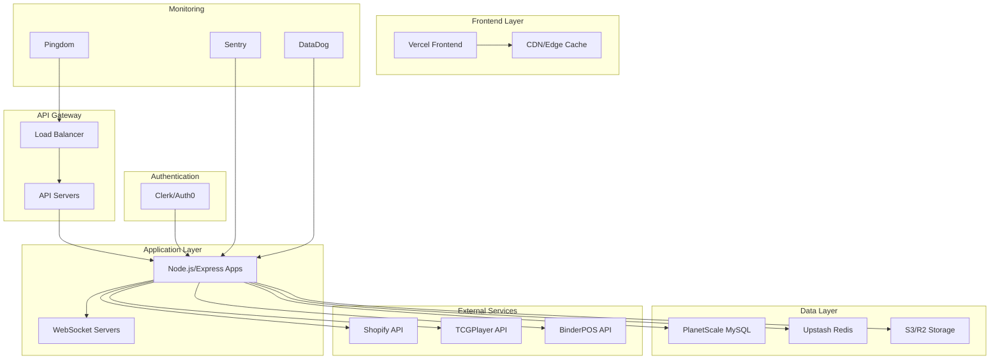

# Production Deployment Strategy for CardStore Operations Layer

## 🌐 Multi-User Hosting Architecture

### Overview
To transform the CardStore Operations Layer from a single-user development tool into a multi-tenant SaaS platform, we need a robust cloud infrastructure that supports scalability, security, and reliability.

## 🏗️ Recommended Technology Stack

### 1. **Application Hosting & Runtime**

#### **Primary Recommendation: Vercel + Railway**
- **Frontend**: Vercel (Next.js deployment)
- **Backend**: Railway (Node.js/Docker containers)
- **Benefits**: 
  - Seamless CI/CD integration
  - Automatic scaling
  - Built-in monitoring
  - Cost-effective for startups

#### **Alternative: AWS Full Stack**
- **Frontend**: AWS Amplify or CloudFront + S3
- **Backend**: AWS ECS Fargate or Lambda
- **Benefits**: 
  - Enterprise-grade reliability
  - Comprehensive service ecosystem
  - Advanced security features

#### **Budget Option: DigitalOcean**
- **App Platform**: Full-stack deployment
- **Droplets**: Custom server configuration
- **Benefits**: 
  - Predictable pricing
  - Simple management
  - Good performance/cost ratio

### 2. **Database & Storage Solutions**

#### **Primary Database: PlanetScale (MySQL)**
```yaml
Advantages:
  - Serverless MySQL with branching
  - Automatic scaling
  - Built-in connection pooling
  - Prisma compatibility
  - Generous free tier

Configuration:
  - Production branch for live data
  - Development branches for testing
  - Automatic backups
  - Global edge caching
```

#### **Alternative: Supabase (PostgreSQL)**
```yaml
Advantages:
  - PostgreSQL with real-time features
  - Built-in authentication
  - Row-level security
  - Real-time subscriptions
  - Open source

Features:
  - Automatic API generation
  - Built-in user management
  - Real-time database changes
  - Edge functions
```

#### **Redis Cache: Upstash**
```yaml
Purpose:
  - Session storage
  - Rate limiting
  - Real-time data caching
  - WebSocket connection management

Benefits:
  - Serverless Redis
  - Global edge locations
  - Pay-per-request pricing
  - REST API compatibility
```

#### **File Storage: AWS S3 or Cloudflare R2**
```yaml
Use Cases:
  - User uploads
  - Export files
  - Static assets
  - Backup storage

Features:
  - CDN integration
  - Automatic compression
  - Lifecycle policies
  - Cross-region replication
```

### 3. **Authentication & User Management**

#### **Recommended: Clerk**
```yaml
Features:
  - Complete user management
  - Social login providers
  - Multi-factor authentication
  - Organization management
  - Session management
  - Webhooks for user events

Integration:
  - React/Next.js components
  - Backend middleware
  - User metadata storage
  - Role-based access control
```

#### **Alternative: Auth0**
```yaml
Features:
  - Enterprise SSO
  - Advanced security rules
  - Custom domains
  - Extensive integrations
  - Compliance certifications

Use Case:
  - Enterprise customers
  - Complex authentication flows
  - Regulatory compliance
```

#### **Budget Option: NextAuth.js**
```yaml
Features:
  - Open source
  - Multiple providers
  - JWT/session support
  - Database adapters

Considerations:
  - More development overhead
  - Self-managed security
  - Custom UI required
```

### 4. **Multi-Tenancy Architecture**

#### **Tenant Isolation Strategy**
```typescript
// Database Schema Design
interface Tenant {
  id: string;
  name: string;
  subdomain: string;
  plan: 'free' | 'pro' | 'enterprise';
  settings: TenantSettings;
  createdAt: Date;
  updatedAt: Date;
}

interface User {
  id: string;
  email: string;
  tenantId: string;
  role: 'owner' | 'admin' | 'member';
  permissions: Permission[];
}

// Row-Level Security (RLS) Example
CREATE POLICY tenant_isolation ON products
  FOR ALL TO authenticated
  USING (tenant_id = current_setting('app.current_tenant_id'));
```

#### **Subdomain Routing**
```yaml
Architecture:
  - customer1.cardstore.app → Tenant 1
  - customer2.cardstore.app → Tenant 2
  - app.cardstore.app → Main application

Implementation:
  - Wildcard SSL certificates
  - Dynamic routing based on subdomain
  - Tenant context injection
  - Isolated data access
```

### 5. **Monitoring & Observability**

#### **Application Monitoring: Sentry**
```yaml
Features:
  - Error tracking
  - Performance monitoring
  - Release tracking
  - User feedback
  - Custom dashboards

Integration:
  - Frontend error boundary
  - Backend error middleware
  - Performance profiling
  - Custom metrics
```

#### **Infrastructure Monitoring: DataDog or New Relic**
```yaml
Metrics:
  - Server performance
  - Database queries
  - API response times
  - User activity
  - Business metrics

Alerts:
  - Error rate thresholds
  - Performance degradation
  - Resource utilization
  - Security incidents
```

#### **Uptime Monitoring: Pingdom or UptimeRobot**
```yaml
Monitoring:
  - API endpoint availability
  - Page load times
  - SSL certificate expiry
  - DNS resolution
  - Global performance
```

### 6. **CI/CD Pipeline**

#### **GitHub Actions Workflow**
```yaml
name: Deploy CardStore Operations Layer

on:
  push:
    branches: [main, staging]

jobs:
  test:
    runs-on: ubuntu-latest
    steps:
      - uses: actions/checkout@v3
      - name: Setup Node.js
        uses: actions/setup-node@v3
        with:
          node-version: '18'
      - name: Install dependencies
        run: npm ci
      - name: Run tests
        run: npm test
      - name: Type check
        run: npm run type-check
      - name: Lint
        run: npm run lint

  deploy-staging:
    if: github.ref == 'refs/heads/staging'
    needs: test
    runs-on: ubuntu-latest
    steps:
      - name: Deploy to staging
        run: |
          # Deploy to staging environment
          
  deploy-production:
    if: github.ref == 'refs/heads/main'
    needs: test
    runs-on: ubuntu-latest
    steps:
      - name: Deploy to production
        run: |
          # Deploy to production environment
```

## 🔒 Security Considerations

### 1. **Data Protection**
```yaml
Encryption:
  - TLS 1.3 for all communications
  - Database encryption at rest
  - Application-level field encryption
  - Secure key management (AWS KMS/HashiCorp Vault)

Access Control:
  - Role-based permissions
  - API rate limiting
  - IP whitelisting options
  - Audit logging
```

### 2. **Compliance**
```yaml
Standards:
  - SOC 2 Type II
  - GDPR compliance
  - CCPA compliance
  - PCI DSS (if handling payments)

Implementation:
  - Data retention policies
  - Right to deletion
  - Data export capabilities
  - Privacy controls
```

### 3. **Backup & Disaster Recovery**
```yaml
Strategy:
  - Automated daily backups
  - Cross-region replication
  - Point-in-time recovery
  - Disaster recovery testing

RTO/RPO Targets:
  - Recovery Time Objective: < 4 hours
  - Recovery Point Objective: < 1 hour
  - 99.9% uptime SLA
```

## 💰 Cost Optimization Strategy

### **Tier 1: MVP Launch (0-100 users)**
```yaml
Monthly Cost: ~$200-400

Services:
  - Vercel Pro: $20/month
  - Railway: $50-100/month
  - PlanetScale: $29/month
  - Upstash Redis: $20/month
  - Clerk: $25/month
  - Sentry: $26/month
  - Domain & SSL: $15/month

Features:
  - Basic multi-tenancy
  - Core functionality
  - Standard support
```

### **Tier 2: Growth Phase (100-1000 users)**
```yaml
Monthly Cost: ~$800-1500

Additional Services:
  - Enhanced monitoring
  - Advanced analytics
  - Priority support
  - Additional regions
  - Increased limits

Optimizations:
  - Reserved capacity discounts
  - Annual billing savings
  - Resource right-sizing
```

### **Tier 3: Scale Phase (1000+ users)**
```yaml
Monthly Cost: ~$2000-5000

Enterprise Features:
  - Dedicated infrastructure
  - Custom integrations
  - White-label options
  - Enterprise support
  - Compliance certifications

Cost Management:
  - Usage-based pricing
  - Auto-scaling policies
  - Resource optimization
  - Bulk discounts
```

## 🚀 Deployment Roadmap

### **Phase 1: Foundation (Weeks 1-2)**
- [ ] Set up hosting infrastructure
- [ ] Configure databases and caching
- [ ] Implement authentication system
- [ ] Set up monitoring and logging
- [ ] Create CI/CD pipeline

### **Phase 2: Multi-Tenancy (Weeks 3-4)**
- [ ] Implement tenant isolation
- [ ] Add subdomain routing
- [ ] Create user management
- [ ] Set up billing integration
- [ ] Add usage analytics

### **Phase 3: Production Ready (Weeks 5-6)**
- [ ] Security hardening
- [ ] Performance optimization
- [ ] Backup and recovery
- [ ] Documentation and support
- [ ] Load testing and monitoring

### **Phase 4: Scale & Optimize (Ongoing)**
- [ ] Auto-scaling configuration
- [ ] Cost optimization
- [ ] Feature enhancements
- [ ] Customer feedback integration
- [ ] Continuous improvement

## 📊 Recommended Architecture Diagram



## 🎯 Success Metrics

### **Technical KPIs**
- 99.9% uptime
- < 200ms API response time
- < 2s page load time
- Zero data loss
- < 1% error rate

### **Business KPIs**
- User acquisition cost
- Monthly recurring revenue
- Customer lifetime value
- Churn rate
- Feature adoption

### **Operational KPIs**
- Deployment frequency
- Lead time for changes
- Mean time to recovery
- Change failure rate

This comprehensive deployment strategy provides a scalable, secure, and cost-effective path to transform the CardStore Operations Layer into a successful multi-tenant SaaS platform.