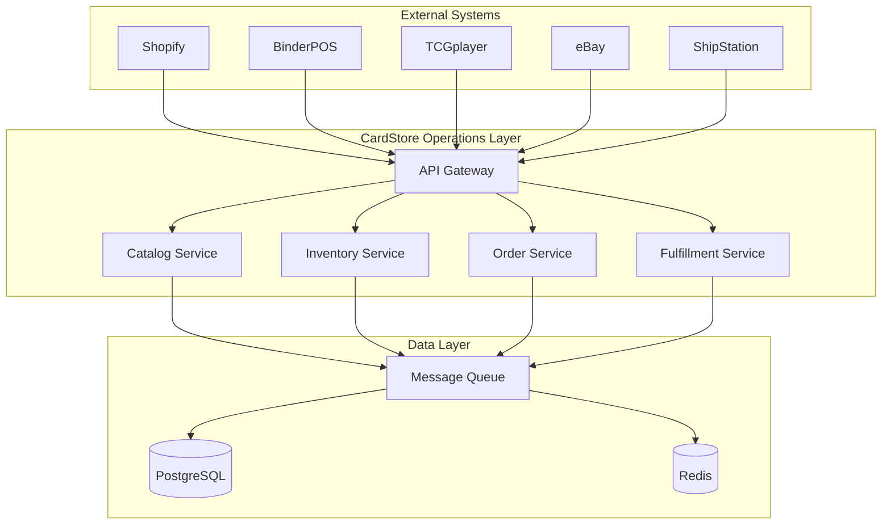

# CardStore Operations Layer - Documentation

## Overview

The CardStore Operations Layer is a comprehensive operations platform that integrates with existing systems (BinderPOS for in-store POS, Shopify as ecommerce backend, TCGplayer for marketplace) to provide advanced inventory management, multi-channel marketplace syndication, purchasing/receiving workflows, and unified fulfillment capabilities for game and trading card stores.

## Documentation Structure

### Getting Started Documents

#### 🚀 [Getting Started Guide](./GETTING_STARTED.md)
**Start here!** Comprehensive setup guide for users of all technical levels:
- Quick start with automated setup wizard (5 minutes)
- Manual setup instructions for advanced users
- Platform-specific installation guides
- Configuration examples and troubleshooting integration

#### 🏥 [Onboarding System Overview](./ONBOARDING_SYSTEM.md)
Complete overview of the guided setup experience:
- Interactive setup wizard features
- Health check system capabilities
- User journey documentation
- Maintenance and future enhancements

#### 🔧 [Troubleshooting Guide](./TROUBLESHOOTING.md)
Solutions to common setup and runtime issues:
- Quick diagnosis with health check integration
- Platform-specific troubleshooting
- Recovery procedures and support contacts

### Core Documents

#### 1. [Product Requirements Document (PRD)](./PRD.md)
Comprehensive product requirements including:
- Business objectives and success metrics
- Functional and non-functional requirements
- User stories and acceptance criteria
- Timeline and milestones

#### 2. [Architecture Foundation](../ARCHITECTURE_FOUNDATION.md)
High-level architectural overview including:
- Technology stack recommendations
- System architecture diagrams
- Core design principles
- Service organization

#### 3. [Technical Design Specification](./TECHNICAL_DESIGN.md)
Detailed technical design including:
- Service architecture and interfaces
- Data models and relationships
- Event-driven architecture patterns
- Security and performance considerations

#### 4. [Database Schema Design](./DATABASE_SCHEMA.md)
Complete database design including:
- Table structures and relationships
- Indexes and performance optimization
- Migration strategy
- Multi-tenancy implementation

#### 5. [Integration Patterns](./INTEGRATION_PATTERNS.md)
External system integration patterns including:
- Shopify integration (webhooks, API)
- BinderPOS integration strategies
- TCGplayer integration patterns
- Marketplace connectors (eBay, Amazon)

#### 6. [API Specifications](./API_SPECIFICATIONS.md)
Complete API documentation including:
- REST API endpoints
- Request/response formats
- Authentication and authorization
- Error handling patterns

### Implementation Documents

#### 7. [Security and Compliance Requirements](./SECURITY_COMPLIANCE.md) *(Pending)*
Security framework including:
- Authentication and authorization
- Data protection and encryption
- Compliance requirements (PCI DSS)
- Security monitoring and incident response

#### 8. [Deployment and Infrastructure](./DEPLOYMENT_INFRASTRUCTURE.md) *(Pending)*
Infrastructure and deployment strategy including:
- Cloud architecture
- Container orchestration
- CI/CD pipelines
- Monitoring and observability

#### 9. [Testing Strategy](./TESTING_STRATEGY.md) *(Pending)*
Quality assurance approach including:
- Unit and integration testing
- End-to-end testing
- Performance testing
- Security testing

#### 10. [External API Research](./EXTERNAL_API_RESEARCH.md) *(Pending)*
Research on external system capabilities:
- BinderPOS API documentation and capabilities
- TCGplayer API integration patterns
- Marketplace API requirements

### Process Documents

#### 11. [Development Workflow](./DEVELOPMENT_WORKFLOW.md) *(Pending)*
Development processes including:
- Git workflow and branching strategy
- Code review process
- Release management
- Contribution guidelines

#### 12. [Monitoring and Operations](./MONITORING_OPERATIONS.md) *(Pending)*
Operational procedures including:
- System monitoring and alerting
- Log management and analysis
- Incident response procedures
- Performance optimization

#### 13. [User Stories and Acceptance Criteria](./USER_STORIES.md) *(Pending)*
Detailed user stories for Phase 1 features:
- Epic breakdown
- Acceptance criteria
- Testing scenarios

#### 14. [Data Flow Diagrams](./DATA_FLOW_DIAGRAMS.md) *(Pending)*
System interaction patterns including:
- Order processing flows
- Inventory synchronization
- Event propagation patterns

#### 15. [Risk Assessment](./RISK_ASSESSMENT.md) *(Pending)*
Risk analysis and mitigation strategies:
- Technical risks
- Business risks
- Operational risks
- Mitigation plans

## Quick Start Guide

### 🚀 New to CardStore? Start Here!
1. **[Getting Started Guide](./GETTING_STARTED.md)** - Complete setup in 5 minutes
2. **Run the setup wizard**: `npm run setup`
3. **Verify everything works**: `npm run health`
4. **Start developing**: `npm run dev`

### For Product Managers
1. Start with the [PRD](./PRD.md) for business requirements
2. Review [User Stories](./USER_STORIES.md) for feature details
3. Check [Risk Assessment](./RISK_ASSESSMENT.md) for project risks

### For Engineers
1. **[Getting Started Guide](./GETTING_STARTED.md)** - Setup and first steps
2. Review [Architecture Foundation](../ARCHITECTURE_FOUNDATION.md) for system overview
3. Study [Technical Design](./TECHNICAL_DESIGN.md) for implementation details
4. Reference [API Specifications](./API_SPECIFICATIONS.md) for interface contracts
5. Check [Database Schema](./DATABASE_SCHEMA.md) for data models

### For DevOps Engineers
1. **[Getting Started Guide](./GETTING_STARTED.md)** - Infrastructure setup
2. Review [Deployment and Infrastructure](./DEPLOYMENT_INFRASTRUCTURE.md)
3. Study [Monitoring and Operations](./MONITORING_OPERATIONS.md)
4. Check [Security and Compliance](./SECURITY_COMPLIANCE.md)

### For QA Engineers
1. **[Getting Started Guide](./GETTING_STARTED.md)** - Test environment setup
2. Review [Testing Strategy](./TESTING_STRATEGY.md)
3. Study [User Stories](./USER_STORIES.md) for acceptance criteria
4. Reference [API Specifications](./API_SPECIFICATIONS.md) for testing endpoints

### 🆘 Need Help?
- **[Troubleshooting Guide](./TROUBLESHOOTING.md)** - Common issues and solutions
- **Health check**: `npm run health` - Diagnose system problems
- **Support**: engineering@cardstore.com

## System Overview

### Key Components
- **Shopify Integration**: Primary system of record for products, customers, and orders
- **BinderPOS Integration**: In-store POS system integration
- **TCGplayer Integration**: Marketplace integration and price feeds
- **Multi-Channel Sales**: eBay, Amazon, Google marketplace connectors
- **Inventory Management**: Multi-location inventory with channel buffers
- **Order Fulfillment**: Unified order processing and batch fulfillment
- **Purchasing**: Distributor integration and receiving workflows

### Technology Stack
- **Runtime**: Node.js 18+ with TypeScript
- **Database**: PostgreSQL 15+ with Redis caching
- **Message Queue**: NATS JetStream for event streaming
- **API Framework**: Express.js with OpenAPI documentation
- **Container**: Docker with Kubernetes orchestration
- **Monitoring**: Prometheus + Grafana + Jaeger

### Integration Architecture

## Development Phases

### Phase 1: Foundation (Weeks 1-8)
- Shopify integration and webhook processing
- Core catalog and inventory services
- Basic admin interface
- CSV import/export functionality

### Phase 2: Fulfillment and eBay (Weeks 6-14)
- Unified order management
- Batch fulfillment and shipping integration
- eBay marketplace connector
- Inventory synchronization across channels

### Phase 3: Purchasing and Advanced Features (Weeks 12-20)
- Distributor integration and purchase orders
- Receiving workflow
- Advanced reporting and analytics
- Online buylist (if prioritized)

### Phase 4: Scale and Optimization (Weeks 18-24)
- Performance optimization
- Additional marketplace connectors (Amazon/Google)
- Advanced pricing rules and automation
- Mobile optimization

## Contributing

### Documentation Updates
1. Follow the existing document structure and formatting
2. Update the table of contents when adding new sections
3. Include Mermaid diagrams for complex workflows
4. Reference related documents using relative links

### Review Process
1. All documentation changes require review
2. Technical documents should be reviewed by engineering leads
3. Business documents should be reviewed by product management
4. Architecture changes require architecture review

## Support and Contact

For questions about this documentation or the CardStore Operations Layer:

- **Engineering Team**: engineering@cardstore.com
- **Product Team**: product@cardstore.com
- **Architecture Questions**: architecture@cardstore.com

## Version History

| Version | Date | Changes | Author |
|---------|------|---------|--------|
| 1.0 | 2025-08-02 | Initial documentation suite | Engineering Team |

---

*This documentation is maintained by the CardStore Engineering Team and is updated regularly as the system evolves.*