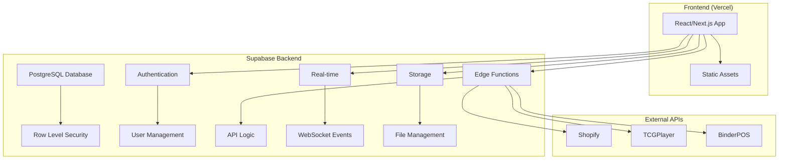

# Supabase + Vercel Deployment Strategy

## 🚀 Perfect Stack for CardStore Operations Layer

Using Supabase as your backend is an excellent choice! This combination provides incredible value and functionality:

### **Why Supabase + Vercel is Ideal**

| Feature | Benefit | Cost Impact |
|---------|---------|-------------|
| **Supabase Database** | PostgreSQL with real-time features | $25/month (vs $29 PlanetScale) |
| **Supabase Auth** | Built-in authentication system | Saves $25/month (vs Clerk) |
| **Supabase Storage** | File storage included | Saves $20/month (vs separate S3) |
| **Supabase Edge Functions** | Serverless backend functions | Saves $50-100/month (vs Railway) |
| **Supabase Real-time** | WebSocket functionality built-in | Saves $20/month (vs separate Redis) |
| **Vercel Frontend** | You already have this! | $20/month |

### **Total Monthly Cost: ~$45-70** (vs $150-250 with other stack)

## 🏗️ Optimized Architecture



## 🛠️ Implementation Strategy

### **Phase 1: Migrate to Supabase (2-3 days)**

#### 1. **Database Migration**
```sql
-- Supabase automatically handles multi-tenancy with RLS
-- Create your existing tables with tenant_id columns

CREATE TABLE tenants (
  id UUID DEFAULT gen_random_uuid() PRIMARY KEY,
  name TEXT NOT NULL,
  subdomain TEXT UNIQUE NOT NULL,
  plan TEXT DEFAULT 'free',
  settings JSONB DEFAULT '{}',
  created_at TIMESTAMP WITH TIME ZONE DEFAULT NOW(),
  updated_at TIMESTAMP WITH TIME ZONE DEFAULT NOW()
);

CREATE TABLE products (
  id UUID DEFAULT gen_random_uuid() PRIMARY KEY,
  tenant_id UUID REFERENCES tenants(id) ON DELETE CASCADE,
  sku TEXT NOT NULL,
  name TEXT NOT NULL,
  price DECIMAL(10,2),
  inventory_count INTEGER DEFAULT 0,
  created_at TIMESTAMP WITH TIME ZONE DEFAULT NOW(),
  updated_at TIMESTAMP WITH TIME ZONE DEFAULT NOW()
);

-- Enable Row Level Security
ALTER TABLE products ENABLE ROW LEVEL SECURITY;

-- Create policy for tenant isolation
CREATE POLICY "Users can only access their tenant's products" ON products
  FOR ALL USING (tenant_id = (SELECT tenant_id FROM auth.users WHERE id = auth.uid()));
```

#### 2. **Replace Prisma with Supabase Client**
```typescript
// lib/supabase.ts
import { createClient } from '@supabase/supabase-js'

const supabaseUrl = process.env.NEXT_PUBLIC_SUPABASE_URL!
const supabaseAnonKey = process.env.NEXT_PUBLIC_SUPABASE_ANON_KEY!

export const supabase = createClient(supabaseUrl, supabaseAnonKey)

// For server-side operations
export const supabaseAdmin = createClient(
  supabaseUrl,
  process.env.SUPABASE_SERVICE_ROLE_KEY!
)
```

#### 3. **Convert API Routes to Edge Functions**
```typescript
// supabase/functions/products/index.ts
import { serve } from "https://deno.land/std@0.168.0/http/server.ts"
import { createClient } from 'https://esm.sh/@supabase/supabase-js@2'

serve(async (req) => {
  const supabase = createClient(
    Deno.env.get('SUPABASE_URL') ?? '',
    Deno.env.get('SUPABASE_ANON_KEY') ?? ''
  )

  // Get user from JWT
  const authHeader = req.headers.get('Authorization')!
  const token = authHeader.replace('Bearer ', '')
  const { data: { user } } = await supabase.auth.getUser(token)

  if (!user) {
    return new Response('Unauthorized', { status: 401 })
  }

  // Your existing API logic here
  const { data: products } = await supabase
    .from('products')
    .select('*')
    .eq('tenant_id', user.user_metadata.tenant_id)

  return new Response(JSON.stringify(products), {
    headers: { 'Content-Type': 'application/json' }
  })
})
```

### **Phase 2: Frontend Integration (1-2 days)**

#### 1. **Update Frontend to Use Supabase**
```javascript
// frontend/js/api.js - Updated for Supabase
import { createClient } from '@supabase/supabase-js'

class SupabaseAPI {
  constructor() {
    this.supabase = createClient(
      'YOUR_SUPABASE_URL',
      'YOUR_SUPABASE_ANON_KEY'
    )
    this.user = null
  }

  async signIn(email, password) {
    const { data, error } = await this.supabase.auth.signInWithPassword({
      email,
      password
    })
    
    if (data.user) {
      this.user = data.user
      return { success: true, user: data.user }
    }
    
    return { success: false, error: error.message }
  }

  async getProducts() {
    const { data, error } = await this.supabase
      .from('products')
      .select('*')
      .order('created_at', { ascending: false })
    
    return { success: !error, data, error }
  }

  // Real-time subscriptions
  subscribeToProducts(callback) {
    return this.supabase
      .channel('products')
      .on('postgres_changes', 
        { event: '*', schema: 'public', table: 'products' },
        callback
      )
      .subscribe()
  }
}

window.api = new SupabaseAPI()
```

#### 2. **Add Real-time Features**
```javascript
// Real-time health monitoring
window.api.supabase
  .channel('system_health')
  .on('broadcast', { event: 'health_update' }, (payload) => {
    updateHealthDisplay(payload.data)
  })
  .subscribe()

// Real-time activity logging
function logActivity(message, type = 'info') {
  window.api.supabase
    .channel('activity')
    .send({
      type: 'broadcast',
      event: 'activity_log',
      payload: { message, type, timestamp: new Date().toISOString() }
    })
}
```

### **Phase 3: Authentication & Multi-tenancy (1 day)**

#### 1. **Supabase Auth Setup**
```sql
-- Create custom claims for tenant information
CREATE OR REPLACE FUNCTION public.handle_new_user()
RETURNS trigger AS $$
BEGIN
  -- Extract tenant from email domain or subdomain
  INSERT INTO public.user_profiles (id, email, tenant_id)
  VALUES (
    NEW.id,
    NEW.email,
    (SELECT id FROM tenants WHERE subdomain = split_part(NEW.email, '@', 2))
  );
  RETURN NEW;
END;
$$ LANGUAGE plpgsql SECURITY DEFINER;

-- Trigger for new user signup
CREATE TRIGGER on_auth_user_created
  AFTER INSERT ON auth.users
  FOR EACH ROW EXECUTE PROCEDURE public.handle_new_user();
```

#### 2. **Frontend Auth Integration**
```javascript
// Update wizard.js for Supabase auth
class OnboardingWizard {
  async handleSignup(email, password, tenantName) {
    // Create tenant first
    const { data: tenant } = await window.api.supabase
      .from('tenants')
      .insert({
        name: tenantName,
        subdomain: tenantName.toLowerCase().replace(/\s+/g, '-')
      })
      .select()
      .single()

    // Sign up user with tenant metadata
    const { data, error } = await window.api.supabase.auth.signUp({
      email,
      password,
      options: {
        data: {
          tenant_id: tenant.id,
          tenant_name: tenantName
        }
      }
    })

    return { success: !error, data, error }
  }
}
```

### **Phase 4: Deploy to Vercel (30 minutes)**

#### 1. **Vercel Configuration**
```json
// vercel.json
{
  "version": 2,
  "env": {
    "NEXT_PUBLIC_SUPABASE_URL": "@supabase-url",
    "NEXT_PUBLIC_SUPABASE_ANON_KEY": "@supabase-anon-key",
    "SUPABASE_SERVICE_ROLE_KEY": "@supabase-service-key"
  },
  "build": {
    "env": {
      "NEXT_PUBLIC_SUPABASE_URL": "@supabase-url",
      "NEXT_PUBLIC_SUPABASE_ANON_KEY": "@supabase-anon-key"
    }
  }
}
```

#### 2. **Deploy Commands**
```bash
# Set environment variables
vercel env add NEXT_PUBLIC_SUPABASE_URL
vercel env add NEXT_PUBLIC_SUPABASE_ANON_KEY
vercel env add SUPABASE_SERVICE_ROLE_KEY

# Deploy
vercel --prod

# Configure custom domain with wildcard
vercel domains add cardstore.app
vercel domains add *.cardstore.app
```

## 🎯 Supabase-Specific Advantages

### **1. Built-in Real-time**
```javascript
// No need for separate WebSocket server
const subscription = supabase
  .channel('health_monitoring')
  .on('postgres_changes', 
    { event: 'UPDATE', schema: 'public', table: 'system_health' },
    (payload) => updateHealthDashboard(payload.new)
  )
  .subscribe()
```

### **2. Automatic API Generation**
```javascript
// No need to write CRUD APIs - Supabase generates them
const { data: products } = await supabase
  .from('products')
  .select(`
    *,
    inventory:inventory_items(*)
  `)
  .eq('tenant_id', tenantId)
  .order('created_at', { ascending: false })
```

### **3. Built-in File Storage**
```javascript
// Handle file uploads directly
const uploadFile = async (file, bucket = 'uploads') => {
  const { data, error } = await supabase.storage
    .from(bucket)
    .upload(`${tenantId}/${file.name}`, file)
  
  return { success: !error, data, error }
}
```

### **4. Edge Functions for Complex Logic**
```typescript
// supabase/functions/shopify-sync/index.ts
serve(async (req) => {
  // Your existing Shopify integration logic
  // Runs on the edge, close to your users
  // Automatically scales
})
```

## 💰 Cost Comparison

### **Supabase + Vercel Stack**
| Service | Cost | Features |
|---------|------|----------|
| Supabase Pro | $25/month | Database, Auth, Storage, Edge Functions, Real-time |
| Vercel Pro | $20/month | Frontend hosting, CDN, Analytics |
| **Total** | **$45/month** | Complete full-stack solution |

### **Previous Stack**
| Service | Cost | Features |
|---------|------|----------|
| Railway | $50-100/month | Backend hosting |
| PlanetScale | $29/month | Database only |
| Clerk | $25/month | Auth only |
| Upstash | $20/month | Redis only |
| Vercel | $20/month | Frontend |
| **Total** | **$144-194/month** | Same functionality |

### **Savings: $99-149/month (68-77% reduction!)**

## 🚀 Migration Timeline

### **Day 1: Database Setup**
- Create Supabase project
- Set up database schema
- Configure Row Level Security
- Import existing data

### **Day 2: Backend Migration**
- Convert API routes to Edge Functions
- Update authentication flow
- Test database operations

### **Day 3: Frontend Updates**
- Replace API calls with Supabase client
- Add real-time subscriptions
- Update authentication UI

### **Day 4: Deploy & Test**
- Deploy to Vercel
- Configure custom domains
- End-to-end testing

### **Day 5: Go Live**
- DNS cutover
- Monitor performance
- User acceptance testing

## 🎉 Immediate Benefits

1. **Massive Cost Savings**: 68-77% reduction in monthly costs
2. **Simplified Architecture**: One backend service instead of 4-5
3. **Real-time by Default**: Built-in WebSocket functionality
4. **Automatic Scaling**: Supabase handles all infrastructure
5. **Better Developer Experience**: Less configuration, more features
6. **Existing Account**: You're already set up!

This Supabase + Vercel approach gives you a more powerful, cost-effective, and maintainable solution while leveraging services you already have access to. The migration can be completed in less than a week with significant ongoing cost savings.