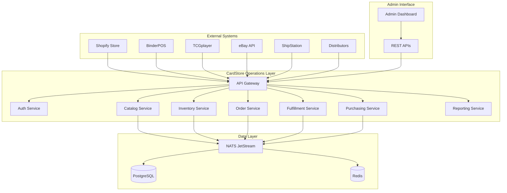

# CardStore Operations Layer - Technical Design Specification

## Document Information
- **Version**: 1.0
- **Date**: 2025-08-02
- **Status**: Draft
- **Owner**: Engineering Team
- **Related Documents**: [PRD](./PRD.md), [Architecture Foundation](../ARCHITECTURE_FOUNDATION.md)

## Table of Contents
1. [System Overview](#system-overview)
2. [Service Architecture](#service-architecture)
3. [Data Models](#data-models)
4. [API Specifications](#api-specifications)
5. [Integration Patterns](#integration-patterns)
6. [Event-Driven Architecture](#event-driven-architecture)
7. [Security Design](#security-design)
8. [Performance and Scalability](#performance-and-scalability)
9. [Deployment Architecture](#deployment-architecture)
10. [Monitoring and Observability](#monitoring-and-observability)

## System Overview

### Architecture Principles
- **Domain-Driven Design**: Services organized around business domains
- **Event-Driven Architecture**: Loose coupling through asynchronous events
- **API-First**: All services expose well-defined REST/GraphQL APIs
- **Cloud-Native**: Containerized, stateless, horizontally scalable
- **Observability**: Comprehensive logging, metrics, and tracing

### Technology Stack
```yaml
Runtime: Node.js 18+ with TypeScript
Framework: Express.js with OpenAPI 3.0
Database: PostgreSQL 15+ with Prisma ORM
Cache: Redis 7+ for sessions and caching
Message Queue: NATS JetStream for event streaming
API Gateway: Kong or AWS API Gateway
Monitoring: Prometheus + Grafana + Jaeger
Container: Docker with Kubernetes orchestration
```

### System Context Diagram


## Service Architecture

### Core Services

#### 1. API Gateway Service
**Purpose**: Single entry point for all client requests
```typescript
interface APIGatewayConfig {
  routes: RouteConfig[];
  rateLimit: RateLimitConfig;
  authentication: AuthConfig;
  cors: CORSConfig;
  logging: LoggingConfig;
}

interface RouteConfig {
  path: string;
  method: HTTPMethod;
  service: string;
  authentication: boolean;
  rateLimit?: number;
  timeout?: number;
}
```

**Responsibilities**:
- Request routing and load balancing
- Authentication and authorization
- Rate limiting and throttling
- Request/response logging
- CORS handling
- API versioning

#### 2. Authentication Service
**Purpose**: Centralized authentication and authorization
```typescript
interface User {
  id: string;
  email: string;
  roles: Role[];
  tenantId: string;
  lastLoginAt?: Date;
  isActive: boolean;
}

interface Role {
  id: string;
  name: string;
  permissions: Permission[];
}

interface Permission {
  resource: string;
  actions: string[];
}
```

**Responsibilities**:
- OAuth 2.0/OIDC authentication
- JWT token management
- Role-based access control (RBAC)
- Multi-tenant isolation
- Session management

#### 3. Catalog Service
**Purpose**: Product catalog management with TCG attributes
```typescript
interface CatalogService {
  // Product Management
  createProduct(data: CreateProductRequest): Promise<Product>;
  updateProduct(id: string, data: UpdateProductRequest): Promise<Product>;
  getProduct(id: string): Promise<Product>;
  searchProducts(query: ProductSearchQuery): Promise<ProductSearchResult>;
  
  // Variant Management
  createVariant(productId: string, data: CreateVariantRequest): Promise<ProductVariant>;
  updateVariant(id: string, data: UpdateVariantRequest): Promise<ProductVariant>;
  bulkUpdateVariants(updates: VariantUpdate[]): Promise<BulkUpdateResult>;
  
  // TCG Attributes
  updateTCGAttributes(variantId: string, attributes: TCGAttributes): Promise<void>;
  searchByTCGAttributes(query: TCGAttributeQuery): Promise<ProductVariant[]>;
  
  // Shopify Sync
  syncFromShopify(shopifyProductId: string): Promise<Product>;
  syncToShopifyMetafields(variantId: string): Promise<void>;
}

interface TCGAttributes {
  language?: string;
  set?: string;
  rarity?: string;
  condition?: string;
  foil?: boolean;
  grading?: GradingInfo;
  serialNumber?: string;
}

interface GradingInfo {
  company: string;
  grade: string;
  certNumber: string;
  gradedAt: Date;
}
```

#### 4. Inventory Service
**Purpose**: Multi-location inventory management with channel buffers
```typescript
interface InventoryService {
  // Inventory Operations
  getInventory(variantId: string, locationId?: string): Promise<InventoryItem[]>;
  updateInventory(updates: InventoryUpdate[]): Promise<void>;
  reserveInventory(reservations: InventoryReservation[]): Promise<ReservationResult>;
  releaseReservation(reservationId: string): Promise<void>;
  
  // Location Management
  createLocation(data: CreateLocationRequest): Promise<InventoryLocation>;
  updateLocation(id: string, data: UpdateLocationRequest): Promise<InventoryLocation>;
  getLocations(): Promise<InventoryLocation[]>;
  
  // Channel Buffers
  setChannelBuffer(variantId: string, channel: string, buffer: number): Promise<void>;
  getAvailableToSell(variantId: string, channel: string): Promise<number>;
  
  // Stock Movements
  recordStockMovement(movement: StockMovement): Promise<void>;
  getStockHistory(variantId: string, locationId?: string): Promise<StockMovement[]>;
  
  // Reconciliation
  reconcileWithShopify(): Promise<ReconciliationReport>;
  reconcileWithChannel(channel: string): Promise<ReconciliationReport>;
}

interface InventoryUpdate {
  variantId: string;
  locationId: string;
  quantityChange: number;
  reason: 'sale' | 'restock' | 'adjustment' | 'return' | 'damage';
  reference?: string;
}

interface StockMovement {
  id: string;
  variantId: string;
  locationId: string;
  type: 'in' | 'out' | 'transfer';
  quantity: number;
  reason: string;
  reference?: string;
  createdAt: Date;
  createdBy: string;
}
```

#### 5. Order Service
**Purpose**: Unified order management across all channels
```typescript
interface OrderService {
  // Order Management
  createOrder(data: CreateOrderRequest): Promise<Order>;
  updateOrder(id: string, data: UpdateOrderRequest): Promise<Order>;
  getOrder(id: string): Promise<Order>;
  searchOrders(query: OrderSearchQuery): Promise<OrderSearchResult>;
  
  // Order Processing
  processOrder(orderId: string): Promise<void>;
  fulfillOrder(orderId: string, fulfillment: FulfillmentRequest): Promise<void>;
  cancelOrder(orderId: string, reason: string): Promise<void>;
  
  // Returns and Refunds
  createReturn(orderId: string, items: ReturnItem[]): Promise<Return>;
  processReturn(returnId: string, disposition: ReturnDisposition): Promise<void>;
  
  // Channel Integration
  syncOrderFromChannel(channel: string, externalOrderId: string): Promise<Order>;
  updateChannelOrderStatus(orderId: string, status: OrderStatus): Promise<void>;
}

interface Order {
  id: string;
  externalOrderId?: string;
  shopifyOrderId?: string;
  source: OrderSource;
  customerId?: string;
  status: OrderStatus;
  financialStatus: FinancialStatus;
  fulfillmentStatus: FulfillmentStatus;
  lineItems: OrderLineItem[];
  shippingAddress?: Address;
  billingAddress?: Address;
  totalPrice: number;
  currency: string;
  tags: string[];
  notes?: string;
  createdAt: Date;
  updatedAt: Date;
}

type OrderSource = 'shopify' | 'binderpos' | 'tcgplayer' | 'ebay' | 'amazon' | 'google';
type OrderStatus = 'pending' | 'processing' | 'fulfilled' | 'cancelled';
type FinancialStatus = 'pending' | 'paid' | 'refunded' | 'partially_refunded';
type FulfillmentStatus = 'unfulfilled' | 'partial' | 'fulfilled';
```

#### 6. Fulfillment Service
**Purpose**: Order fulfillment, picking, packing, and shipping
```typescript
interface FulfillmentService {
  // Batch Management
  createBatch(orders: string[]): Promise<FulfillmentBatch>;
  getBatch(id: string): Promise<FulfillmentBatch>;
  optimizeBatch(batchId: string): Promise<OptimizedPickList>;
  
  // Picking
  generatePickList(batchId: string): Promise<PickList>;
  recordPick(batchId: string, picks: PickRecord[]): Promise<void>;
  completePicking(batchId: string): Promise<void>;
  
  // Packing
  createPackage(orderId: string, items: PackageItem[]): Promise<Package>;
  updatePackage(packageId: string, data: UpdatePackageRequest): Promise<Package>;
  
  // Shipping
  generateShippingLabel(packageId: string, service: ShippingService): Promise<ShippingLabel>;
  trackPackage(trackingNumber: string): Promise<TrackingInfo>;
  updateTrackingInfo(packageId: string): Promise<void>;
  
  // Returns
  processReturn(returnId: string, items: ReturnItem[]): Promise<void>;
  restockItems(items: RestockItem[]): Promise<void>;
}

interface FulfillmentBatch {
  id: string;
  orderIds: string[];
  status: BatchStatus;
  pickList?: PickList;
  createdAt: Date;
  completedAt?: Date;
  assignedTo?: string;
}

interface PickList {
  id: string;
  batchId: string;
  items: PickListItem[];
  optimizedRoute: LocationRoute[];
  estimatedTime: number;
}

interface PickListItem {
  variantId: string;
  sku: string;
  title: string;
  quantity: number;
  location: string;
  binLocation?: string;
  orderIds: string[];
}
```

### Supporting Services

#### 7. Pricing Service
**Purpose**: Multi-channel pricing management
```typescript
interface PricingService {
  // Price Management
  getPrice(variantId: string, channel?: string): Promise<Price>;
  updatePrice(variantId: string, channel: string, price: number): Promise<void>;
  bulkUpdatePrices(updates: PriceUpdate[]): Promise<BulkUpdateResult>;
  
  // Pricing Rules
  createPricingRule(rule: PricingRule): Promise<PricingRule>;
  applyPricingRule(ruleId: string, variantIds: string[]): Promise<void>;
  
  // Market Data
  getMarketPrice(variantId: string): Promise<MarketPrice>;
  updateMarketPrices(): Promise<void>;
}

interface PricingRule {
  id: string;
  name: string;
  channel: string;
  type: 'percentage' | 'fixed' | 'market_based';
  value: number;
  conditions: PricingCondition[];
  isActive: boolean;
}
```

#### 8. Purchasing Service
**Purpose**: Distributor integration and purchase order management
```typescript
interface PurchasingService {
  // Purchase Orders
  createPurchaseOrder(data: CreatePORequest): Promise<PurchaseOrder>;
  submitPurchaseOrder(poId: string): Promise<void>;
  getPurchaseOrder(id: string): Promise<PurchaseOrder>;
  
  // Receiving
  createReceiving(poId: string): Promise<Receiving>;
  recordReceipt(receivingId: string, items: ReceiptItem[]): Promise<void>;
  completeReceiving(receivingId: string): Promise<void>;
  
  // Distributor Integration
  syncDistributorCatalog(distributorId: string): Promise<void>;
  getDistributorPricing(distributorId: string, skus: string[]): Promise<DistributorPrice[]>;
}
```

#### 9. Reporting Service
**Purpose**: Business intelligence and analytics
```typescript
interface ReportingService {
  // Sales Reports
  getSalesReport(params: SalesReportParams): Promise<SalesReport>;
  getChannelPerformance(dateRange: DateRange): Promise<ChannelPerformanceReport>;
  
  // Inventory Reports
  getInventoryValuation(locationId?: string): Promise<InventoryValuationReport>;
  getLowStockReport(threshold?: number): Promise<LowStockReport>;
  getInventoryAging(): Promise<InventoryAgingReport>;
  
  // Operational Reports
  getFulfillmentMetrics(dateRange: DateRange): Promise<FulfillmentMetricsReport>;
  getPurchasingReport(dateRange: DateRange): Promise<PurchasingReport>;
  
  // Scheduled Reports
  scheduleReport(config: ScheduledReportConfig): Promise<ScheduledReport>;
  getScheduledReports(): Promise<ScheduledReport[]>;
}
```

## Data Models

### Core Entities

#### Product and Catalog
```sql
-- Products table
CREATE TABLE products (
    id UUID PRIMARY KEY DEFAULT gen_random_uuid(),
    tenant_id UUID NOT NULL,
    shopify_product_id BIGINT UNIQUE,
    title VARCHAR(255) NOT NULL,
    description TEXT,
    vendor VARCHAR(100),
    product_type VARCHAR(100),
    category VARCHAR(100),
    tags TEXT[],
    status VARCHAR(20) DEFAULT 'active',
    created_at TIMESTAMP WITH TIME ZONE DEFAULT NOW(),
    updated_at TIMESTAMP WITH TIME ZONE DEFAULT NOW()
);

-- Product variants table
CREATE TABLE product_variants (
    id UUID PRIMARY KEY DEFAULT gen_random_uuid(),
    product_id UUID NOT NULL REFERENCES products(id) ON DELETE CASCADE,
    shopify_variant_id BIGINT UNIQUE,
    sku VARCHAR(100) UNIQUE NOT NULL,
    barcode VARCHAR(50),
    title VARCHAR(255) NOT NULL,
    price DECIMAL(10,2) NOT NULL,
    compare_at_price DECIMAL(10,2),
    weight DECIMAL(8,2),
    weight_unit VARCHAR(10) DEFAULT 'g',
    requires_shipping BOOLEAN DEFAULT true,
    taxable BOOLEAN DEFAULT true,
    
    -- TCG-specific attributes
    tcg_attributes JSONB DEFAULT '{}',
    
    created_at TIMESTAMP WITH TIME ZONE DEFAULT NOW(),
    updated_at TIMESTAMP WITH TIME ZONE DEFAULT NOW()
);

-- TCG attributes structure in JSONB
{
  "language": "English",
  "set": "Alpha",
  "rarity": "Rare",
  "condition": "Near Mint",
  "foil": false,
  "grading": {
    "company": "PSA",
    "grade": "10",
    "certNumber": "12345678",
    "gradedAt": "2023-01-15T00:00:00Z"
  },
  "serialNumber": "001/100"
}
```

#### Inventory Management
```sql
-- Inventory locations
CREATE TABLE inventory_locations (
    id UUID PRIMARY KEY DEFAULT gen_random_uuid(),
    tenant_id UUID NOT NULL,
    shopify_location_id BIGINT,
    name VARCHAR(100) NOT NULL,
    type VARCHAR(20) NOT NULL CHECK (type IN ('warehouse', 'store', 'virtual')),
    address JSONB,
    is_active BOOLEAN DEFAULT true,
    created_at TIMESTAMP WITH TIME ZONE DEFAULT NOW()
);

-- Inventory items
CREATE TABLE inventory_items (
    id UUID PRIMARY KEY DEFAULT gen_random_uuid(),
    variant_id UUID NOT NULL REFERENCES product_variants(id),
    location_id UUID NOT NULL REFERENCES inventory_locations(id),
    on_hand INTEGER NOT NULL DEFAULT 0,
    reserved INTEGER NOT NULL DEFAULT 0,
    available INTEGER GENERATED ALWAYS AS (on_hand - reserved) STORED,
    safety_stock INTEGER DEFAULT 0,
    channel_buffers JSONB DEFAULT '{}',
    last_counted_at TIMESTAMP WITH TIME ZONE,
    updated_at TIMESTAMP WITH TIME ZONE DEFAULT NOW(),
    
    UNIQUE(variant_id, location_id)
);

-- Stock movements for audit trail
CREATE TABLE stock_movements (
    id UUID PRIMARY KEY DEFAULT gen_random_uuid(),
    variant_id UUID NOT NULL REFERENCES product_variants(id),
    location_id UUID NOT NULL REFERENCES inventory_locations(id),
    type VARCHAR(20) NOT NULL CHECK (type IN ('in', 'out', 'transfer')),
    quantity INTEGER NOT NULL,
    reason VARCHAR(50) NOT NULL,
    reference VARCHAR(100),
    created_at TIMESTAMP WITH TIME ZONE DEFAULT NOW(),
    created_by UUID NOT NULL
);
```

#### Order Management
```sql
-- Orders table
CREATE TABLE orders (
    id UUID PRIMARY KEY DEFAULT gen_random_uuid(),
    tenant_id UUID NOT NULL,
    shopify_order_id BIGINT,
    external_order_id VARCHAR(100),
    source VARCHAR(20) NOT NULL,
    customer_id UUID,
    order_number VARCHAR(50) NOT NULL,
    status VARCHAR(20) NOT NULL DEFAULT 'pending',
    financial_status VARCHAR(20) NOT NULL DEFAULT 'pending',
    fulfillment_status VARCHAR(20) NOT NULL DEFAULT 'unfulfilled',
    
    -- Pricing
    subtotal_price DECIMAL(10,2) NOT NULL,
    total_tax DECIMAL(10,2) DEFAULT 0,
    total_shipping DECIMAL(10,2) DEFAULT 0,
    total_price DECIMAL(10,2) NOT NULL,
    currency VARCHAR(3) NOT NULL DEFAULT 'USD',
    
    -- Addresses
    shipping_address JSONB,
    billing_address JSONB,
    
    -- Metadata
    tags TEXT[],
    notes TEXT,
    channel_data JSONB DEFAULT '{}',
    
    created_at TIMESTAMP WITH TIME ZONE DEFAULT NOW(),
    updated_at TIMESTAMP WITH TIME ZONE DEFAULT NOW(),
    
    UNIQUE(tenant_id, order_number)
);

-- Order line items
CREATE TABLE order_line_items (
    id UUID PRIMARY KEY DEFAULT gen_random_uuid(),
    order_id UUID NOT NULL REFERENCES orders(id) ON DELETE CASCADE,
    variant_id UUID NOT NULL REFERENCES product_variants(id),
    quantity INTEGER NOT NULL,
    price DECIMAL(10,2) NOT NULL,
    total_discount DECIMAL(10,2) DEFAULT 0,
    fulfilled_quantity INTEGER DEFAULT 0,
    
    -- Product snapshot at time of order
    title VARCHAR(255) NOT NULL,
    sku VARCHAR(100) NOT NULL,
    variant_title VARCHAR(255),
    
    created_at TIMESTAMP WITH TIME ZONE DEFAULT NOW()
);
```

### Indexes and Performance
```sql
-- Product search indexes
CREATE INDEX idx_products_tenant_status ON products(tenant_id, status);
CREATE INDEX idx_products_shopify_id ON products(shopify_product_id);
CREATE INDEX idx_variants_sku ON product_variants(sku);
CREATE INDEX idx_variants_shopify_id ON product_variants(shopify_variant_id);

-- TCG attribute search
CREATE INDEX idx_variants_tcg_attributes ON product_variants USING GIN (tcg_attributes);

-- Inventory indexes
CREATE INDEX idx_inventory_variant_location ON inventory_items(variant_id, location_id);
CREATE INDEX idx_inventory_low_stock ON inventory_items(variant_id) WHERE available <= safety_stock;

-- Order indexes
CREATE INDEX idx_orders_tenant_status ON orders(tenant_id, status);
CREATE INDEX idx_orders_source_created ON orders(source, created_at);
CREATE INDEX idx_orders_shopify_id ON orders(shopify_order_id);
CREATE INDEX idx_orders_external_id ON orders(external_order_id);

-- Stock movement audit
CREATE INDEX idx_stock_movements_variant_created ON stock_movements(variant_id, created_at);
```

## API Specifications

### REST API Design Principles
- **RESTful URLs**: Resource-based URLs with standard HTTP methods
- **JSON API**: Consistent JSON request/response format
- **Pagination**: Cursor-based pagination for large datasets
- **Filtering**: Query parameter-based filtering and sorting
- **Versioning**: URL path versioning (e.g., `/api/v1/`)
- **Error Handling**: Consistent error response format

### Common Response Formats
```typescript
// Success Response
interface APIResponse<T> {
  data: T;
  meta?: {
    pagination?: PaginationMeta;
    total?: number;
  };
}

// Error Response
interface APIError {
  error: {
    code: string;
    message: string;
    details?: Record<string, any>;
    timestamp: string;
    requestId: string;
  };
}

// Pagination
interface PaginationMeta {
  hasNextPage: boolean;
  hasPreviousPage: boolean;
  startCursor?: string;
  endCursor?: string;
  totalCount?: number;
}
```

### Core API Endpoints

#### Catalog API
```yaml
# Products
GET    /api/v1/products                 # List products
POST   /api/v1/products                 # Create product
GET    /api/v1/products/{id}            # Get product
PUT    /api/v1/products/{id}            # Update product
DELETE /api/v1/products/{id}            # Delete product

# Product Variants
GET    /api/v1/products/{id}/variants   # List variants
POST   /api/v1/products/{id}/variants   # Create variant
GET    /api/v1/variants/{id}            # Get variant
PUT    /api/v1/variants/{id}            # Update variant
DELETE /api/v1/variants/{id}            # Delete variant

# TCG Attributes
PUT    /api/v1/variants/{id}/tcg-attributes  # Update TCG attributes
GET    /api/v1/variants/search               # Search by TCG attributes

# Bulk Operations
POST   /api/v1/products/bulk            # Bulk create/update
POST   /api/v1/variants/bulk            # Bulk create/update
```

#### Inventory API
```yaml
# Inventory Items
GET    /api/v1/inventory                # List inventory
GET    /api/v1/inventory/{variantId}    # Get variant inventory
PUT    /api/v1/inventory/{variantId}    # Update inventory
POST   /api/v1/inventory/bulk          # Bulk inventory update

# Locations
GET    /api/v1/locations               # List locations
POST   /api/v1/locations               # Create location
GET    /api/v1/locations/{id}          # Get location
PUT    /api/v1/locations/{id}          # Update location

# Stock Movements
GET    /api/v1/stock-movements         # List movements
POST   /api/v1/stock-movements         # Record movement
GET    /api/v1/variants/{id}/movements # Get variant movements

# Channel Buffers
GET    /api/v1/variants/{id}/buffers   # Get channel buffers
PUT    /api/v1/variants/{id}/buffers   # Update channel buffers
```

#### Order API
```yaml
# Orders
GET    /api/v1/orders                  # List orders
POST   /api/v1/orders                  # Create order
GET    /api/v1/orders/{id}             # Get order
PUT    /api/v1/orders/{id}             # Update order
DELETE /api/v1/orders/{id}             # Cancel order

# Order Processing
POST   /api/v1/orders/{id}/process     # Process order
POST   /api/v1/orders/{id}/fulfill     # Fulfill order
POST   /api/v1/orders/{id}/cancel      # Cancel order

# Returns
GET    /api/v1/returns                 # List returns
POST   /api/v1/orders/{id}/returns     # Create return
GET    /api/v1/returns/{id}            # Get return
PUT    /api/v1/returns/{id}            # Update return
```

### GraphQL Schema (Optional)
```graphql
type Product {
  id: ID!
  shopifyProductId: String
  title: String!
  description: String
  vendor: String
  category: String
  variants: [ProductVariant!]!
  createdAt: DateTime!
  updatedAt: DateTime!
}

type ProductVariant {
  id: ID!
  shopifyVariantId: String
  sku: String!
  title: String!
  price: Float!
  tcgAttributes: TCGAttributes
  inventory: [InventoryItem!]!
}

type TCGAttributes {
  language: String
  set: String
  rarity: String
  condition: String
  foil: Boolean
  grading: GradingInfo
  serialNumber: String
}

type Query {
  products(
    first: Int
    after: String
    filter: ProductFilter
    sort: ProductSort
  ): ProductConnection!
  
  product(id: ID!): Product
  
  searchProducts(
    query: String!
    tcgFilter: TCGAttributeFilter
  ): [Product!]!
}

type Mutation {
  createProduct(input: CreateProductInput!): Product!
  updateProduct(id: ID!, input: UpdateProductInput!): Product!
  updateTCGAttributes(variantId: ID!, attributes: TCGAttributesInput!): ProductVariant!
}
```

## Integration Patterns

### Webhook Processing Pattern
```typescript
interface WebhookProcessor {
  // Webhook validation
  validateSignature(payload: string, signature: string, secret: string): boolean;
  
  // Idempotency handling
  isProcessed(webhookId: string): Promise<boolean>;
  markProcessed(webhookId: string): Promise<void>;
  
  // Event processing
  processWebhook(webhook: WebhookPayload): Promise<void>;
}

// Shopify webhook processor
class ShopifyWebhookProcessor implements WebhookProcessor {
  async processWebhook(webhook: ShopifyWebhookPayload): Promise<void> {
    const { topic, payload } = webhook;
    
    switch (topic) {
      case 'products/create':
      case 'products/update':
        await this.syncProduct(payload);
        break;
        
      case 'orders/create':
        await this.processOrder(payload);
        break;
        
      case 'inventory_levels/update':
        await this.syncInventory(payload);
        break;
        
      default:
        console.warn(`Unhandled webhook topic: ${topic}`);
    }
  }
  
  private async syncProduct(product: ShopifyProduct): Promise<void> {
    // Transform Shopify product to internal format
    // Update catalog service
    // Emit product updated event
  }
}
```

### Event Sourcing Pattern
```typescript
interface Event {
  id: string;
  aggregateId: string;
  aggregateType: string;
  eventType: string;
  eventData: Record<string, any>;
  eventVersion: number;
  timestamp: Date;
  causationId?: string;
  correlationId?: string;
}

interface EventStore {
  append(streamId: string, events: Event[]): Promise<void>;
  getEvents(streamId: string, fromVersion?: number): Promise<Event[]>;
  subscribe(eventType: string, handler: EventHandler): void;
}

// Example: Inventory aggregate
class InventoryAggregate {
  private events: Event[] = [];
  
  adjustQuantity(variantId: string, locationId: string, quantity: number, reason: string): void {
    const event: InventoryAdjustedEvent = {
      id: generateId(),
      aggregateId: `${variantId}-${locationId}`,
      aggregateType: 'Inventory',
      eventType: 'InventoryAdjusted',
      eventData: { variantId, locationId, quantity, reason },
      eventVersion: this.events.length + 1,
      timestamp: new Date(),
    };
    
    this.events.push(event);
    this.apply(event);
  }
  
  private apply(event: Event): void {
    // Apply event to aggregate state
  }
}
```

### Circuit Breaker Pattern
```typescript
interface CircuitBreakerConfig {
  failureThreshold: number;
  recoveryTimeout: number;
  monitoringPeriod: number;
}

class CircuitBreaker {
  private state: 'CLOSED' | 'OPEN' | 'HALF_OPEN' = 'CLOSED';
  private failureCount = 0;
  private lastFailureTime?: Date;
  
  async execute<T>(operation: () => Promise<T>): Promise<T> {
    if (this.state === 'OPEN') {
      if (this.shouldAttemptReset()) {
        this.state = 'HALF_OPEN';
      } else {
        throw new Error('Circuit breaker is OPEN');
      }
    }
    
    try {
      const result = await operation();
      this.onSuccess();
      return result;
    } catch (error) {
      this.onFailure();
      throw error;
    }
  }
  
  private onSuccess(): void {
    this.failureCount = 0;
    this.state = 'CLOSED';
  }
  
  private onFailure(): void {
    this.failureCount++;
    this.lastFailureTime = new Date();
    
    if (this.failureCount >= this.config.failureThreshold) {
      this.state = 'OPEN';
    }
  }
}
```

## Event-Driven Architecture

### Event Types and Schemas
```typescript
// Base event interface
interface DomainEvent {
  eventId: string;
  eventType: string;
  aggregateId: string;
  aggregateType: string;
  eventVersion: number;
  timestamp: Date;
  tenantId: string;
  causationId?: string;
  correlationId?: string;
  metadata?: Record<string, any>;
}

// Inventory events
interface InventoryChangedEvent extends DomainEvent {
  eventType: 'InventoryChanged';
  eventData: {
    variantId: string;
    locationId: string;
    previousQuantity: number;
    newQuantity: number;
    changeType: 'sale' | 'restock' | 'adjustment' | 'return';
    reason?: string;